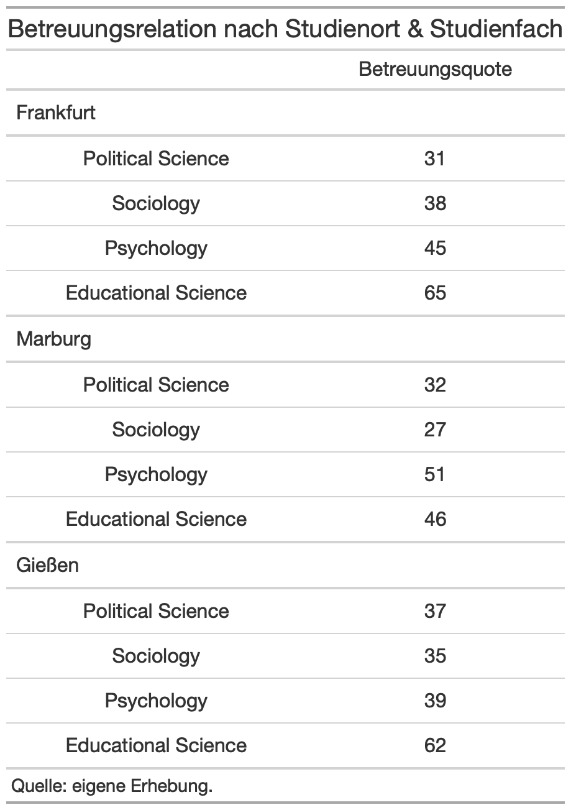

```{r setup, include=FALSE}
knitr::opts_chunk$set(echo = TRUE)

uni <- readRDS("../datasets/uni.rds")
library("viridis")
library("foreign")
library("psych")
library("Hmisc")
library("car")
library("DescTools")
library("ggpubr")
library("ggExtra")
library("readstata13")
library("summarytools")
library("gmodels")
library("corrplot")
library("gt")
library("extrafont")
library("tidyverse")
loadfonts(quiet = TRUE)
library("knitr")
opts_chunk$set(fig.path = 'pics/s6-', # path for calculated figures
               fig.align = 'center',  # alignment of figure (also possible right, left, default)
               fig.show = 'hold', # how to show figures: hold -> direct at the end of code chunk; animate: all plots in an animation
               fig.width = 3,   # figure width
               fig.height = 4,  # figure height
               echo = TRUE,     # Code is printed
               eval = FALSE,    # Code is NOT evaluated
               warning = FALSE, # warnings are NOT displayed
               message = FALSE, # messages are NOT displayed
               size = "tiny",  # latex-size of code chunks
               background = "#E7E7E7", # background color of code chunks
               comment = "", # no hashtags before output
               options(width = 80),
               results = "markdown",
               rows.print = 15
)

example <- table(uni$study, 
                 uni$city)
library("xaringanExtra")
```


## Zum Paket ```gt```
Das *package* ```gt``` inkludiert hilfreiche Funktionen, um Tabellen aus R in ein Format zu exportieren, das in wissenschaftlichen Arbeiten oder bei Präsentationen genutzt werden kann. 

Das Paket ist umfassend und hier werden nur einführende Schritte dargestellt, die aber für erste Projekte im BA-Studium hilfreich sind. Die genaue Dokumentation findet sich in der [Benutzerdokumentation](https://gt.rstudio.com/).

Die generelle Funktionslogik erfolgt bei ```gt``` wie folgt:

<center>

</center> 

All diese verschiedenen Felder können einzeln angesprochen werden und verändert werden.

Bevor wir nun mit den Beispielen starten, müssen wir das *package* selbst laden als auch ```tidyverse```.

```{r install-packages}
# falls noch nicht installiert
# install.packages("gt", 
#                 dependencies = TRUE)
# install.packages("tidyverse",
#                  dependencies = TRUE)

library("gt")
library("tidyverse")
```

## Eine einfache Tabelle
Bevor wir nun Kreuztabellen darstellen, machen wir eine einfache Tabelle. Wir wollen zum Beispiel die Häufigkeiten für die *Studienmotivation* ausgeben lassen (```mot```).

```{r r-table, eval=TRUE}
table(uni$mot)
```

Zuerst müssen wir mit ```tidyverse``` ein *tibble* schaffen, dass wir an ```gt``` übergeben können. Dazu wählen wir aus dem Datensatz die Variable ```mot``` aus, gruppieren die Daten nach ```mot``` und bilden dann mit summarize die jeweilige Summe unter den Ausprägungen der Variable ```mot``` (Funktion ```n()```). Mit ```gt()``` erstellen wir dann die Tabelle:
```{r gt-table1, eval=TRUE}
uni %>% 
  select(mot) %>%  
  group_by(mot) %>% 
  summarise(n = n()) %>% 
  gt()
``` 

Jetzt ist das Format noch etwas unhandlich für Berichte oder Abschlussarbeiten und daher nutzen wir eine weitere Funktion aus ```tidyverse```, nämlich ```pivot_wider()```. Mit ```pivot_wider()``` können wir die Tabelle neu ordnen. Hierbei geben wir dann an, dass die Spaltennamen die Ausprägungen von ```mot``` sind und die Werte (also der Inhalt der ersten und einzigen Zeile) aus der vorherigen Spalte ```n``` entnommen werden. 

```{r gt-table2, eval=TRUE}
uni %>% 
  select(mot) %>%  
  group_by(mot) %>% 
  summarise(n = n()) %>% 
  pivot_wider(names_from = mot,
              values_from = n) %>% 
  gt()
```

Fertig ist die Darstellung der absoluten Häufigkeiten der Variable ```mot```. Dies sieht schon viel schöner aus als in der R Konsole (und ist auch als Bild exportierbar, dazu später mehr). Bevor nun einzelne Formatierungsmöglichkeiten in ```gt``` gezeigt werden, gehen wir über zu Kreuztabellen und zur Ausgabe prozentualer Häufigkeiten.

## Kreuztabelle
Wir nehmen wieder ein Beispiel aus dem Trainingsdatensatz ```uni```. Wir möchten eine Kreuztabelle zwischen Studienort (```city```) und Studienfach (```study```) erstellen. Wir möchten wissen, wie viele Personen jeweils in den einzelnen Städten die spezifischen Fächer studieren. 

``` {r example-crosstable, eval=TRUE}
example
```

Wir wir sehen ist die originäre R Ausgabe nicht gut visuell dargestellt und auch die bisher genutzten Pakete erhöhten zwar die *readibility* in der Konsole, konnten aber nicht den Export unterstützen. Für die Weiterverwendung in anderen Paketen eignet sich daher das *package* ```gt```, mit dem wir Bilddateien aus den Tabellen erstellen können. 

Hierbei greifen wir auf das Paket ```tidyverse``` zurück, in dem wir die Daten für das *package* ```gt``` manipulieren. Nehmen wir das Beispiel einer Kreuztabelle zwischen Studienort und Studienfach von oben. Zuerst selektieren wir zur Vereinfachung den Datensatz auf die zwei genutzten Variablen mit ```select()```. Anschließend gruppieren wir die Daten mit ```group_by()```. Danach nutzen wir ```summarize()```, um die Summen der einzelnen Kombinationen zu bilden (also die späteren Zellen der Tabelle). Bevor wir dann die Funktion ```gt()``` aufrufen, nutzen wir eine weitere Funktion aus ```tidyverse```, nämlich ```pivot_wider()```. 

```{r crosstable, eval=TRUE}
uni %>% 
  select(study, city) %>% 
  group_by(city, study) %>% 
  summarise(n = n()) %>%
  pivot_wider(names_from = city,
              values_from = n)
```
Wir sehen, dass wir nun ein *tibble* haben, der in der ersten Spalte die Ausprägungen von ```study``` hat, und die zweite bis vierte Spalte stellen die Ausprägungen von ```city``` dar. In den einzelnen Feldern befindet sich die Summe der einzelnen Paare. 

## Kreuztabelle mit ```gt```
Als nächstes werden wir jetzt dann die Funktion ```gt()``` aufrufen:
```{r gt-crosstable1, eval=TRUE}
uni %>% 
  select(study, city) %>% 
  group_by(city, study) %>% 
  summarise(n = n()) %>%
  pivot_wider(names_from = city, 
              values_from = n) %>% 
  gt()
```

Nun sehen wir die erste mit ```gt``` erzeugte Kreuztabelle. Bevor wir nun in die Formatierung der Tabelle gehen, schaffen wir erst prozentuale Ausgaben. **Wichtig hierbei**: Die Konvention ist, dass wir Spaltenprozente erstellen.

```{r gt-crosstable-percent, eval = TRUE}
uni %>%
  select(study, city) %>% 
  group_by(city, study) %>%
  summarise(n = n()) %>%
  mutate(prop = n / sum(n))%>%   # neue prozentualer Anteil nach Spalten!
  pivot_wider(names_from = city, 
              values_from = prop) %>% 
  gt()
```

Das Ergebnis irritiert etwas, denn wir haben doppelte Spalten. Dies liegt daran, dass wir weiterhin noch die absoluten Zahlen als Spalte (```n```) mit übergeben haben. Diese schließen wir einfach über ```subset()``` aus:

```{r gt-crosstable-percent2, eval=TRUE}
uni %>%
  select(study, city) %>% 
  group_by(city, study) %>%
  summarise(n = n()) %>%
  mutate(prop = n / sum(n))%>%   # neue prozentualer Anteil nach Spalten!
  subset(select = c("city", "study", "prop")) %>% # die zwei Variablen und prop! 
  pivot_wider(names_from = city, 
              values_from = prop) %>% 
  gt()
```

Nun haben wir also eine Kreuztabelle mit absoluten Häufigkeiten und eine mit relativen Häufigkeiten. In den nächsten Schritten wird die Tabelle formatiert. 

## Formatierungen in ```gt```
Um die Tabellen nun zu formatieren, speichern wir diese zuerst in einem Objekt: Denn R ist objektorientiert! Wir nehmen die absolute Häufigkeitstabelle der Variable ```mot``` und die prozentuale Kreuztabelle ziwschen ```city``` und ```study```. **Wichtig hierbei**: Erinnere dich an die Abbildung zu Beginn, in der alle einzelnen Bereiche einer ```gt```-Tabelle benannt waren!
```{r gt-objects, eval=TRUE}
single <- uni %>% 
  select(mot) %>%  
  group_by(mot) %>% 
  summarise(n = n()) %>% 
  pivot_wider(names_from = mot,
              values_from = n) %>% 
  gt()

cross <- uni %>%
  select(study, city) %>% 
  group_by(city, study) %>%
  summarise(n = n()) %>%
  mutate(prop = n / sum(n))%>%    
  subset(select = c("city", "study", "prop")) %>% 
  pivot_wider(names_from = city, values_from = prop) %>% 
  gt()
```

## Titel ändern
Zuerst fügen wir der Häufigkeitstabelle nun einen Titel hinzu, damit klar ist, um was für Daten es sich handelt.
```{r gt-single1, eval= TRUE}
single %>% 
  tab_header(title = "Abs. Häufigkeit von Studienmotivation")
```

## Alignment ändern
Wie wir sehen, sind die Spalten rechts ausgerichtet, dies können wir ebenfalls ändern und zentrieren es nun:
```{r gt-single2, eval = TRUE}
single %>% 
  tab_header(title = "Abs. Häufigkeit von Studienmotivation") %>% 
  cols_align(align = c("center"))  # auch möglich: auto, left, right
```

## Quelle \& Fußnote hinzufügen
Oft werden unter Tabellen Quellen oder Anmerkungen angegeben, dies können wir auch ganz einfach mit ```gt```machen:
```{r gt-single3, eval=TRUE}
single %>%
  tab_header(title = md("Abs. Häufigkeit von Studienmotivation")) %>% 
  cols_align(align = c("center")) %>% 
  tab_source_note(source_note = "Quelle: eigene Erhebung.") %>%
  tab_source_note(source_note = md("Anmerkungen: Mit *md()* können Textformatierungen wie in Markdown vorgenommen **werden**."))  
```

Manchmal möchte man zu einzelnen Werten auch eine Fußnote einfügen. Wir fügen jetzt eine Fußnote zum Wert *0* ein. Hierbei muss unterschieden werden, ob im ```cells body``` oder in den ```column labels``` eine Fußnote hinzugefügt werden soll. Wir fügen die erste Fußnote in ein ```column label``` ein und die zweite Fußnote in eine Zelle der Tabelle. Wenn wir im ```column label``` eine Fußnote hinzufügen wollen, benutzen wir in der Funktion ```tab_footnote()``` im Argument ```locations``` die Funktion ```cells_column_labels()``` und geben unter ```columns``` die spezifische Spalte an. Wenn wir in einer Zelle eine Fußnote setzen wollen, nutzen wir im Argument ```locations``` die Funktion ```cells_body()``` und geben dort in den Argumenten ```columns``` und ```rows``` die Position(en) an. Dies können auch mehrere sein (mit ```c()``` oder ```1:3```):

```{r gt-single6, eval = TRUE}
single %>%
  tab_header(title = md("Abs. Häufigkeit von Studienmotivation")) %>% 
  cols_align(align = c("center")) %>% 
  tab_source_note(source_note = "Quelle: eigene Erhebung.") %>%
  tab_source_note(source_note = md("Anmerkungen: Mit *md()* können Textformatierungen vorgenommen **werden**.")) %>% 
  tab_footnote(footnote = md("Ein Wert von *0* bedeutet **keinerlei Studienmotivation**."),
               locations = cells_column_labels(columns = "0")) %>% 
  tab_footnote(footnote = md("***Dies ist einfach nur ein Test.***"),
               locations = cells_body(columns = 7,
                                      rows = 1))
```

## Spaltenbreite ändern
Als kleineres Manko sehen wir jetzt noch, dass die Spalten unterschiedlich breit sind. Dies können wir über ```cols_width()``` ändern. Hierbei können wir einzelnen Spalten aufrufen oder einen Bereich an Spalten festlegen. Wir könnten z.B. die Breite von Spalte 4 erhöhen. Hierzu nutzen wir die Hilfsfunktion ```px()```, die die Größe in Pixel angibt. 
```{r gt-single-colwidth, eval=TRUE}
single %>%
  tab_header(title = md("Abs. Häufigkeit von Studienmotivation")) %>% 
  cols_align(align = c("center")) %>% 
  tab_source_note(source_note = "Quelle: eigene Erhebung.") %>%
  tab_source_note(source_note = md("Anmerkungen: Mit *md()* können Textformatierungen vorgenommen **werden**.")) %>% 
  tab_footnote(footnote = md("Ein Wert von *0* bedeutet **keinerlei Studienmotivation**."),
               locations = cells_column_labels(columns = "0")) %>% 
  tab_footnote(footnote = md("***Dies ist einfach nur ein Test.***"),
               locations = cells_body(columns = 7,
                                      rows = 1)) %>% 
  cols_width(4 ~ px(80))
```

Am häufigsten passt man die Breite aller Spalten an, damit die Tabelle gleichmäßig ist: Dies geschieht über die Funktion ```everything()```:
```{r gt-single-colwidth2, eval=TRUE}
single %>%
  tab_header(title = md("Abs. Häufigkeit von Studienmotivation")) %>% 
  cols_align(align = c("center")) %>% 
  tab_source_note(source_note = "Quelle: eigene Erhebung.") %>%
  tab_source_note(source_note = md("Anmerkungen: Mit *md()* können Textformatierungen vorgenommen **werden**.")) %>% 
  tab_footnote(footnote = md("Ein Wert von *0* bedeutet **keinerlei Studienmotivation**."),
               locations = cells_column_labels(columns = "0")) %>% 
  tab_footnote(footnote = md("***Dies ist einfach nur ein Test.***"),
               locations = cells_body(columns = 7,
                                      rows = 1)) %>% 
  cols_width(everything() ~ px(45))
```

## Schriftart \& Schriftgröße ändern
Innerhalb von ```tab_options()``` gibt es eine Vielzahl von Optionen. Um Schriftarten zu ändern, muss man zuvor das *package* ```extrafont``` laden. 

```{r extrafont}
install.packages("extrafont", 
                 dependencies = TRUE)

library("extrafont")

#for mac
loadfonts(quiet = TRUE)

# for windows
loadfonts(device = "win",
          quiet = TRUE)
```

So könnten wir die folgenden Anpassungen zum Beispiel vornehmen. Verändere den Code in der Funktion ```tab_options()``` einfach stellenweise, um zu sehen, was sich in der Darstellung ändert:
```{r gt-single-fonts, eval = TRUE}
single %>%
  tab_header(title = md("Abs. Häufigkeit von Studienmotivation")) %>% 
  cols_align(align = c("center")) %>% 
  tab_source_note(source_note = "Quelle: eigene Erhebung.") %>%
  tab_source_note(source_note = md("Anmerkungen: Mit *md()* können Textformatierungen vorgenommen **werden**.")) %>% 
  tab_footnote(footnote = md("Ein Wert von *0* bedeutet **keinerlei Studienmotivation**"),
               locations = cells_body(columns = c(1, 5), rows = 1)) %>% 
  cols_width(everything() ~ px(45)) %>% 
  tab_options(table.font.names = "Candara",
              table.font.size = 12,
              heading.title.font.size = 14,
              column_labels.font.size = 13,
              source_notes.font.size = 9)

```

Dies stellt nur einen Ausschnitt der Funktionsmöglichkeiten von ```gt``` dar. Es können auch einzelne Zellen spezifisch farbig gestaltet werden und auch nach einer weiteren Variable dargestellt werden. Dazu ist ein Blick in die [Benutzerdokumentation](https://gt.rstudio.com/) hilfreich.

## Anpassungen bei Kreuztabellen
Nun wollen wir abschließend noch die Kreuztablle anpassen. Wir übernehmen die oben eingeführten Anpassungen für den Title, die Spaltenbreite und die Quelle. Die erste Spalte machen wir nun aber breiter als die anderen. Auch richten wir die erste Spalte links aus (wie nach Konvention üblich).

```{r gt-crosstable-adaptions, eval=TRUE}
cross %>% 
  tab_header(title = md("Studienort & Studienwahl")) %>% 
  cols_align(align = "left",
             columns = study) %>% 
  cols_align(align = "center",
             columns = c("Gießen", "Marburg", 'Frankfurt')) %>%  
  tab_source_note(source_note = "Quelle: eigene Erhebung.") %>% 
  cols_width(study ~ px(150),
             everything() ~ px(100)) 
```

Was wir an dieser Stelle noch anpassen wollen, ist das die Zellen jeweils auf zwei Nachkommastellen gerundet werden. Dazu nutzen wir ```fmt()```. Mit dem Argument ```columns``` bestimmen wir in welchen Zeilen gerundet werden soll, mit dem Argument ```decimals``` legen wir die Dezimalstellen fest und wer das Dezimalzeichen ändern möchte, kann dies im Argument ```dec_mark``` machen (dann auch ```sep_mark``` (Tausenderzeichen)  ändern:
```{r gt-crosstable-rounding, eval=TRUE}
cross %>% 
  tab_header(title = md("Studienort & Studienwahl")) %>% 
  cols_align(align = "left",
             columns = study) %>% 
  cols_align(align = "center",
             columns = c("Gießen", "Marburg", 'Frankfurt')) %>%  
  tab_source_note(source_note = "Quelle: eigene Erhebung.") %>% 
  cols_width(study ~ px(150),
             everything() ~ px(100)) %>% 
  fmt_number(columns = c(2:4), 
             decimals = 2,
             dec_mark = ",",
             sep_mark = "."
          )
```

Bevor wir die Einführung ändern möchten wir noch den *Header* in der ersten Spalte ändern. Dies können wir über ```cols_label()```:
```{r gt-crosstable-header, eval=TRUE}
cross %>% 
  tab_header(title = md("Studienort & Studienwahl")) %>% 
  cols_align(align = "left",
             columns = study) %>% 
  cols_align(align = "center",
             columns = c("Gießen", "Marburg", 'Frankfurt')) %>%  
  tab_source_note(source_note = "Quelle: eigene Erhebung.") %>% 
  cols_width(study ~ px(150),
             everything() ~ px(100)) %>% 
  fmt_number(columns = c(2:4), 
             decimals = 2,
             dec_mark = ",",
             sep_mark = ".") %>% 
  cols_label(study = "Studienfach")
```

Auch dabei können mit ```md()``` Formatierungen vorgenommen werden:
```{r gt-crosstable-textformat, eval=TRUE}
cross %>% 
  tab_header(title = md("Studienort & Studienwahl")) %>% 
  cols_align(align = "left",
             columns = study) %>% 
  cols_align(align = "center",
             columns = c("Gießen", "Marburg", 'Frankfurt')) %>%  
  tab_source_note(source_note = "Quelle: eigene Erhebung.") %>% 
  cols_width(study ~ px(150),
             everything() ~ px(100)) %>% 
  fmt_number(columns = c(2:4), 
             decimals = 2,
             dec_mark = ",",
             sep_mark = ".") %>% 
  cols_label(study = md("**Studien-**<br>*fach*"))
```

So, für die Einführung in das *package* ```gt``` ist dies ausreichend. Insbesondere, wenn man eine dritte Gruppenvariable hinzufügt, bietet ```gt``` gute Möglichkeiten direkt in R publizierbare Tabellen zu generieren. 

## Bevor ihr geht, speichert!
Anstatt aus dem Viewer die Dateien zu speichern, kann man diese auch direkt über ```gtsave()``` speichern. Dazu gibt man einfach den Dateinamen ein und R speichert das Objekt im *Working Directory*.
``` {r gt-crosstable-save, eval=TRUE}
cross %>% 
  tab_header(title = md("Studienort & Studienwahl")) %>% 
  cols_align(align = "left",
             columns = study) %>% 
  cols_align(align = "center",
             columns = c("Gießen", "Marburg", 'Frankfurt')) %>%  
  tab_source_note(source_note = "Quelle: eigene Erhebung.") %>% 
  cols_width(study ~ px(150),
             everything() ~ px(100)) %>% 
  fmt_number(columns = c(2:4), 
             decimals = 2) %>% 
  cols_label(study = md("**Studien-**<br>*fach*")) %>% 
  gtsave("mein-erster-gt-plot.png") # auch .html -Table möglich
```

## Labs
Ihr sehr hier drei verschiedene Tabellendarstellungen. Sucht euch eine Tabellendarstellung heraus und stellt diese mithilfe des ```gt```-*packages* nach. 




## Das war's! 