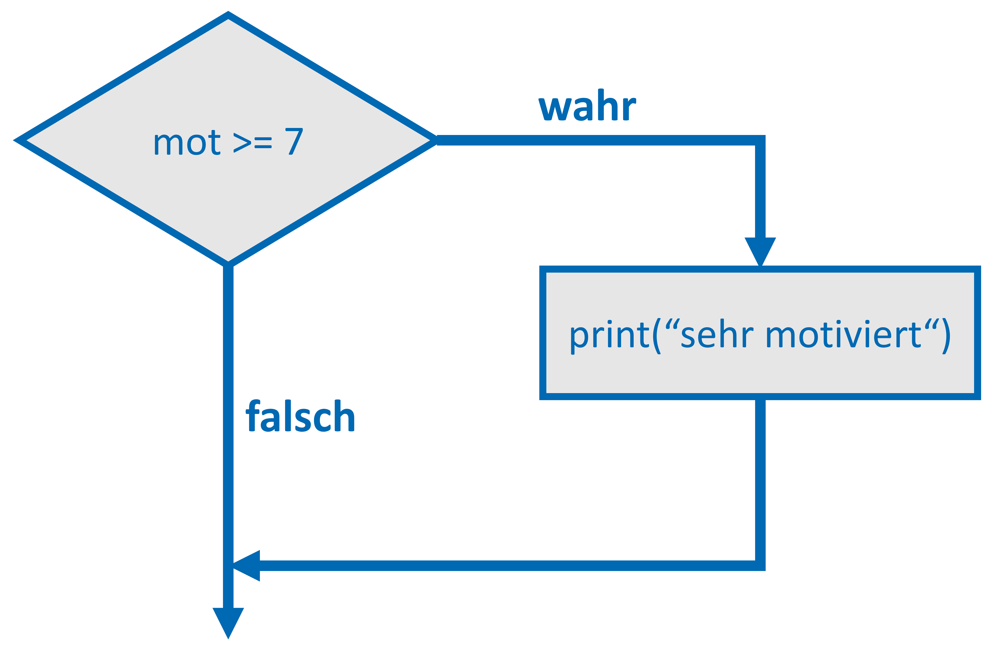
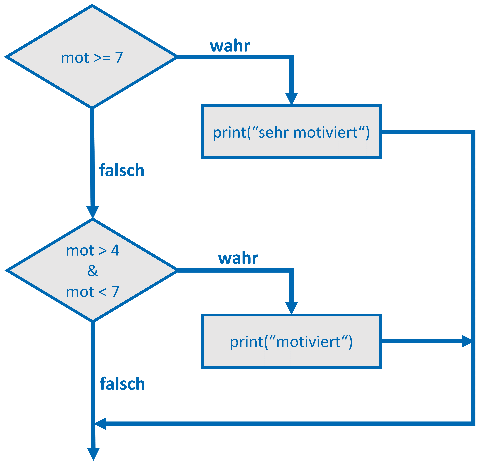
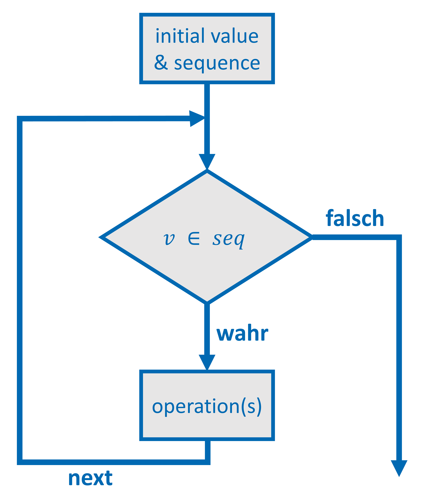
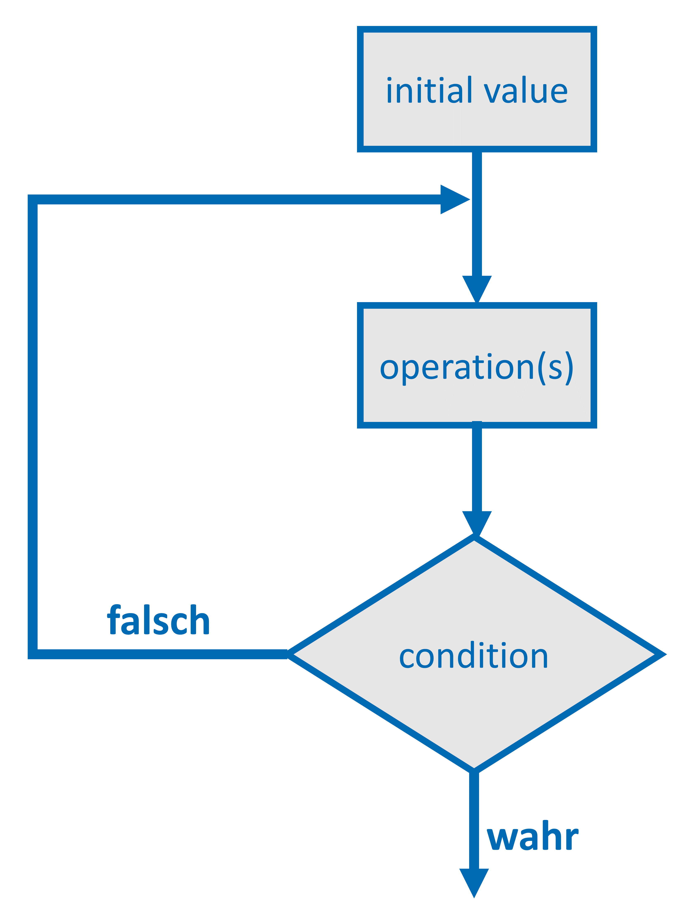

```{r setup, include=FALSE}
library("knitr")
library("rmarkdown")
library("tidyverse")
library("naniar")
library("UpSetR")
library("dotwhisker")

statistics <- readRDS("../datasets/statistics.rds")

opts_chunk$set(#fig.path = 'pics/s6-', # path for calculated figures
               fig.align = 'center',  # alignment of figure (also possible right, left, default)
               fig.show = 'hold', # how to show figures: hold -> direct at the end of code chunk; animate: all plots in an animation
               fig.width = 6,   # figure width
               fig.height = 6,  # figure height
               echo = TRUE,     # Code is printed
               eval = FALSE,    # Code is NOT evaluated
               warning = FALSE, # warnings are NOT displayed
               message = FALSE, # messages are NOT displayed
               size = "tiny",  # latex-size of code chunks
               background = "#E7E7E7", # background color of code chunks
               comment = "", # no hashtags before output
               options(width = 80),
               results = "markdown",
               rows.print = 15
)
             
htmltools::tagList(
  xaringanExtra::use_clipboard(
    button_text = "<i class=\"fa fa-clipboard\"></i>",
    success_text = "<i class=\"fa fa-check\" style=\"color: #90BE6D\"></i>",
    error_text = "<i class=\"fa fa-times-circle\" style=\"color: #F94144\"></i>"
  ),
  rmarkdown::html_dependency_font_awesome()
)
```

# Start
In diesem Teil des Workshops werden zuerst **if**-Ausdrücke wiederholt (bzw. eingeführt) und anschließend die Nutzung von **Schleifen** vorgestellt. Schleifen haben den Vorteil, dass man einen Codierungsschritt auf eine bestimmte Anzahl bzw. Fälle (in Kombination mit **if**) wiederholen kann. Somit erspart man sich Code-Schreibarbeit. Als letztes werden **Funktionen** eingeführt. 


# If-Bedingung
Der **if**-Ausdruck wird dann genutzt, wenn man einen Befehl unter bestimmten Bedingungen ausführen möchte. Dabei wird eine Bedingung (*condition*) überprüft und sofern diese zutrifft (```TRUE```), wird die angegebene Operation durchgeführt. 

Die Logik des einfachen **if**-Ausdrucks ist im Schaubild dargestellt:

<center>
{width=50%}
</center>

Nehmen wir folgendes Beispiel: Wir haben die Studienmotivation eines Studierenden und möchten (ein Vektor ```mot``` mit einem einzigen Wert), sofern dieser auf der Skala ($0$-$10$) einen Wert größer gleich $7$ angegeben hat, die Bemerkung *sehr motiviert* ausgeben.

``` {r if, eval=TRUE}
mot <- 9

if (mot >= 7) {
  print("sehr motiviert")
}
```

Der einfache **if**-Ausdruck folgt also einem ganz klaren Muster:

1. es wird **if** aufgerufen und in Klammern die Bedingung gesetzt: ```if (mot >= 7)```

2. in geschweiften Klammern folgen die Anweisungen, die ausgeführt werden sollen, wenn die Bedingung zutrifft:``` { print("sehr motiviert") }```

Der einfache **if**-Ausdruck kann also ganz leicht umgesetzt werden. 

## else if Ausdruck

Neben dem einfachen **if**-Ausdruck gibt es auch noch die **else if**-Ausdrücke, mit denen man weitere Bedingungen prüfen kann, falls die vorherige Bedingung nicht zutrifft. Hier durchläuft der Prüfprozess also mehrere Bedingungen. Dies ist im Schaubild dargestellt:

<center>
{width=50%}
</center> 

Für einen weiteren Fall eines Studierenden, der auf der Motivation nur $5$ angegeben hat, könnten wir folgende **else if**-Ausdruck schreiben:

```{r else-if, eval=TRUE}
mot <- 5

if (mot >= 7) {
  print("sehr motiviert")
} else if (mot >= 4 & mot < 7) {
  print("motiviert")
}
```

Das heißt, die einfache **if**-Syntax wird hier nur um folgende Punkte ergänzt:

1. eine weitere Anweisung, die mit **else if** eine weitere Bedingung prüft: ```else if (mot >= 4 & mot < 7)```

2. einen weiteren Anweisungsblock für die weitere Bedingung: ```{ print("motiviert")}```

Auch dies ist also sehr leicht umzusetzen. **Wichtig ist hierbei**: Die zweite Bedingung wird nur geprüft, falls die erste Bedingung ```FALSE``` ist. Man kann beliebig viele ```else if```-Prüfungen programmieren. Nehmen wir ein weiteres Beispiel:

```{r else-if2, eval=TRUE}
mot <- 3

if (mot >= 7) {
  print("sehr motiviert")
} else if (mot >= 4 & mot < 7) {
  print("motiviert")
} else if (mot >= 0 & mot < 4) {
  print("nicht motiviert")
}
```

Das einzige, was wir hier verändert haben, ist dass wir eine dritte Prüfbedingung hinzugefügt haben. Wie zuvor wird diese dritte Bedingung erst geprüft, wenn die erste und die zweite Bedingung beide ```FALSE``` sind. **else if**-Ausdrücke haben also eine **hierarchische** Struktur.

## else Ausdruck

Man kann auch dichotome Entscheidungen treffen. Nehmen wir an, wir möchten nur nach *motiviert* und *nicht motiviert* unterscheiden und entscheiden uns, Personen, die einen Wert über $7$ angegeben haben, als motiviert zu bewerten und Personen mit niedrigeren Skalenwerten als nicht motiviert. Wir prüfen hier nur die Bedingung, ob der Wert größer $7$ ist. Falls dies nicht zutrifft, entscheiden wir mit **else** (in allen anderen Fällen), dass *nicht motiviert* ausgegeben wird.**Else** beinhaltet also eine Anweisung, die ausgeführt wird für alle Fälle, auf denen die zuvor genannte **if**-Bedingung nicht zutrifft (also ```FALSE``` ergibt).

``` {r else, eval=TRUE}
mot <- 5

if (mot >= 7) {
  print("sehr motiviert")
} else {
  print("nicht motiviert")
}
```

Auch hier ist der Aufbau recht einfach:

1. wir fügen nach der **if**-Bedingung mit **else** eine weitere Anweisung hinzu, die aber keine Bedingung mehr hat: ```else```. Zur Erinnerung: Bei **else ist die Bedingung inhärent, da es alle ```FALSE```-Fälle der vorigen Bedingung beinhaltet.

2. Wir geben auch hier wieder in geschweiften Klammern die Anweisung an: ```{ print("nicht motiviert)}```

Dies waren einfache Beispiele von **if** und **else if**-Ausdrücken. In der Regel werden diese aber innerhalb von Schleifen genutzt (z.B. wenn man Entscheidungen für alle Beobachtungen innerhalb eines Datensatzes treffen möchte). Dies wird im Nachfolgenden gezeigt.

# Loops

Mit **Loops** (*Iterationen*) kann man Operationen wiederholen. Die Wiederholungen geschehen dabei *n*-Mal, wobei *n* ein ganzzahliger Laufwert ist (*integer*). Für die Wiederholungen gibt man einen Startwert fest. Wie oben bereits erwähnt, wendet man dies z.B. an, wenn man eigene Rekodierungen schreiben will ohne bereits bestehende Funktionen verwenden zu wollen.

Wir können folgende Arten von Iterationen unterscheiden:

1. **for**

2. **while**

3. **repeat** (**do while**)

## for

In der **for**-Loop werden Operationen so lange durchgeführt, bis das Ende einer vordefinierten Sequenz erreicht ist (z.B. über alle Beobachtungen eines Datensatzes). Mit dieser Schleife setzen wir einen Beginn und ein Ende fest und die Operation werden innerhalb dieser Sequenz ausgeführt.

Im Schaubild ist die Logik des **for-loops** dargestellt. 

<center>
{width=50%}
</center>

### Syntax

Die allgemeine Syntax sieht wie folgt aus:
```{r for, eval=TRUE}
for (i in 0:5) {
  print(i)
}
```

Die Struktur ist ähnlich zur **if**-Struktur:

1. Wir initiieren die Schleife und setzen die gewünschte Sequenz in Klammern: ```for (i in 0:5)```

2. Anschließend setzen wir wieder in geschweiften Klammern die Anweisungen, die für jeden Durchgang ausgeführt werden sollen: ```{ print(i) }```

Die Sequenz beinhaltet einen sich ändernden Zählindex (```i```), der mit jedem Durchgang der Schleife steigt und dann die Sequenzangabe (```in 0:n```). Im Beispiel soll die Schleife also sechsmal durchgeführt werden, von **0** bis **5**. ```i``` beginnt mit dem Wert **0** und sobald der Wert **6** erreicht, wird die Schleife beendet. **Wichtig**: In **for**-Schleifen steigt ```i``` iterativ immer um **1**.

Man kann alternativ Objekte als Beginn oder Ende angeben. Dafür muss man diese zuvor deklarieren und kann diese anschließend nutzen. Zuerst schaffen wir mit ```n <-5```` einen Zielwert, den wir dann über das Objekt in der Schleife aufgreifen.
```{r for2, eval=TRUE}
# Beispiel Zielwert
n <- 5

for (i in 0:n) {
  print(i)
}

# Beispiel Startwert
start <- 3

for (i in start:n) {
  print(i)
}
```

### Beispiel for-loop

Wir schaffen eine einfache **for**-loop und geben dabei immer den Wert eines Vektors ```teacher``` aus, der die:den Dozentin:en für einen Kurs beinhaltet. Insgesamt haben wir $5$ Dozent:innen. Im Beispiel bestimmen wir das Ende der Schleife einfach über die Länge des Vektors, den wir nutzen. Denn wir möchten, dass alle Fälle durchgegangen werden. Wir geben nacheinander die Namen der Dozent:innen aus:

``` {r for3, eval=TRUE}
teacher <- c("Baecker", 
             "Mueller",
             "Kaufmann",
             "Bauer",
             "Schuster"
             )

for (i in 1:length(teacher)) {
  print(paste0("Dozent:in ", 
               i, 
               " ist ",
               teacher[i]
               )
        )
}
```
Wir bedienen uns hierbei der Funktion ```paste0()```, die Text mit Objekten als Ausgabe verbinden kann. Die Funktion ```paste0()``` hat zwischen den Elementen in der Funktion keine Leerstelle (die Funktion ```paste()``` setzt zwischen allen Elementen ein Leerzeichen (oder ein im Argument ```sep``` angegebenes Trennzeichen.)

### for-loop mit else if-Ausdruck

Nehmen wir das Beispiel aus den **if**-Ausdrücken. Wir möchten nun eine neue Variable im Datensatz schaffen, die eine Wertebeschreibung nutzt. Wir benötigen also die **else if**-Bedingung aus dem vorherigen Kapitel und bilden nun um diese einen **for**-loop durch die Länge des Datensatzes. Das Ergebnis speichern wir in einer neuen Variable ```motText``` und lassen es für jeden Fall einzeln ausgeben (```print()```). Zur Anschaulichkeit gehen wir hier zwei Schritte: Wir speichern erst die Beschreibung in ```motivation``` und übertragen es dann an den Wert in ```statistics$motText```. **Wichtig ist**, dass wir nicht den Laufindex bei ```statistics$motText``` vergessen, da wir ja nur den spezifischen Fall mit dem neuen Wert belegen möchten.

```{r for-elseif, eval=TRUE}
for (i in 1:length(statistics$mot)) {
  if (statistics$mot[i] >= 7) {
    motivation <- "sehr motiviert"
    statistics$motText[i] <-  motivation
  } else if (statistics$mot[i] >= 4 & statistics$mot[i] < 7) {
    motivation <- "motiviert"
    statistics$motText[i] <-  motivation
  } else if (statistics$mot[i] >= 0 & statistics$mot[i] < 4) {
    motivation <- "nicht motiviert"
    statistics$motText[i] <-  motivation
  }
  
  print(paste0("Student:in ", 
               i, 
               " ist ",
               motivation
               )
        )
}
```

**Eine kleine Aufgabe**: Wie oben genannt, haben wir unnötig viele Zeilen hier geschrieben. Probiere einmal die Schleife zu verschlanken!

### for-loop mit next

Als zweites Beispiel möchten wir nun eine neue Variable schaffen, die Beschreibungen von ```grade2``` in Abhängigkeit des Notenwertes inkludiert. Zur Erinnerung: Die Variable ```grade2``` weist ```NA's``` auf. Dies ist nur ein Funktionsbeispiel für die Kombination von **for**-loops und **if**-Ausdrücken. Es empfiehlt sich zum Rekodieren die Funktionen aus dem Paket ```dplyr``` (```case_when()```) oder ```car``` (```recode()```) zu nutzen. 

``` {r table, eval=TRUE}
table(statistics$grade2, 
      useNA = "ifany"
      )
```

In der **for**-loop möchten wir nur Beschriftungen in einer neuen Variable einfügen, sofern kein ```NA``` vorliegt. Dies können wir über einen **else if**-Ausdruck steuern. 

Im Beispiel sieht man, dass wir zwei **if**-Ausdrücke genutzt haben. Zuerst prüfen wir, ob die Beobachtung ```NA``` in ```grade2``` aufweist. Die Funktion ```is.na()``` liefert einen logischen Wert (```TRUE```, ```FALSE```). Trifft das zu (```TRUE```), weisen wir ```NA``` auf der neuen Variable zu und springen mit dem Befehl ```next``` zum nächsten Fall (Schleife beginnt mit nächstem ```i``` von vorne). Mit ```next``` überspringen wir die nächsten Anweisungen und die Schleife beginnt mit der nächsten Iteration wieder von vorne. Wenn kein ```NA``` vorliegt, wird der zweite **if**-Ausdruck durchgeprüft, in dem wir mit mehreren **else if**-Ausdrücken die Textbeschriftungen zuweisen. 

``` {r for-next, eval=TRUE}
for (i in 1:length(statistics$grade2)) {
  if (is.na(statistics$grade2[i])) {
    statistics$g2text[i] <- NA
    next
  } 
  
  if (statistics$grade2[i] >= 13) {
    statistics$g2text[i] <- "sehr gut"
  } else if (statistics$grade2[i] >= 10 & statistics$grade2[i] < 13) {
    statistics$g2text[i] <- "gut"
  } else if (statistics$grade2[i] >= 7 & statistics$grade2[i] < 10) {
    statistics$g2text[i] <- "befriedigend"
  } else if (statistics$grade2[i] >= 5 & statistics$grade2[i] < 7) {
    statistics$g2text[i] <- "ausreichend"
  } else {
    statistics$g2text[i] <- "nicht bestanden"
  }
}

table(statistics$g2text)

```

**Eine kleine Aufgabe**: Anstatt ```next``` zu verwenden, könnte man hier auch mit nur mit **if**-Ausdrücken zum selben Ergebnis kommen. Schreibe die Schleife so um, dass diese ohne ```next``` auskommt.

### Vor- & Nachteile

**for**-loops werden recht häufig genutzt und können auch verschachtelt werden. Nicht angewendet werden können **for**-loops, wenn die Anzahl der Durchläufe nicht bestimmbar ist ($\rightarrow$ **while**-loop). Ein Nachteil von **for**-loops ist, dass diese in der Regel sehr langsam sind. Auch ist es in verschachtelten **for**-loops oft nur schwer nachvollziehbar, was genau gemacht wird. Das heißt auch, dass die Fehlersuche manchmal mühsam sein kann. 

Als Alternativen zu **for**-loops kann man die ```apply()```-Funktionen nutzen (Funktionalität ist durch Entwickler geprüft). Nähere Informationen zu den ```apply()```-Funktionen finden sich [hier](https://de.wikibooks.org/wiki/GNU_R:_apply). Dennoch können in manchen Situationen eigene geschrieben Funktionen auf **for**-loops zurückgreifen, so dass es sinnvoll ist, diese Grundfunktionen auch zu kennen.  

## while
In der **while**-loop werden Instruktionen ausgeführt, solange eine Bedingung (*condition*) zutrifft. Man nennt dies auch **kopfgesteuert**: Denn bei jedem Durchlauf wird am Schleifenkopf die Bedingung neu geprüft. Wenn diese Bedingung (*condition*) nicht mehr zutrifft (```FALSE```), dann wird die **while**-loop beendet. Der Durchlauf von Code ist also abhängig von einer Bedingung. Sollte die Bedingung direkt zu Beginn nicht mehr zutreffen, wird der **while**-loop direkt beendet ohne auch nur eine Instruktion einmalig ausgeführt zu haben. 

<center>
{width=50%}
</center>

### Syntax

Die allgemeine Syntax einer **while**-loop sieht wie folgt aus: 

```{r while, eval=TRUE}
# Startwert
i <- 0

while (i < 5) {
  print(i)  # Anweisung

  i <- i + 1 # Inkrement
}
```
Auch hier ist die Syntax wieder ähnlich zum **if**-Ausdruck:

1. Wir initiieren die Schleife und fügen in Klammern die Bedingung ein: ```while (i < 5)```

2. Wir setzen in geschweiften Klammern die Instruktionen, die ausgeführt werden, bis die Bedingung zutrifft: ```{ i <- i +1     print(i)}```

Wichtiger Unterschied zur **for**-loop: Die Sequenz wird hier nicht angegeben, es muss also innerhalb der Schleife das Inkrement angegeben werden (```i <- i + 1```). Passiert dies nicht, dreht sich die Schleife unendlich und man muss einen Programmabsturz erzwingen. Im Unterschied zur **for**-loop ist der Inkrement aber beliebig. Wir können also auch 

### Beispiel while-loop

Nehmen wir das Beispiel aus dem **for**-loop, das sich auch als **while**-loop darstellen lässt: 

``` {r while2, eval=TRUE}
teacher <- c("Baecker",
             "Mueller",
             "Kaufmann", 
             "Bauer",
             "Schuster"
             )

pos <- 1

while (pos <= length(teacher)) {
  print(paste0("Dozent:in ",
               pos, 
               " ist ",
               teacher[pos]
               )
        )
  
  pos <- pos + 1
}
```
In der **while**-loop geben wir die Abbruch-Bedingung bekannt und diese wird vor dem ersten Ausführen bereits das erste Mal kontrolliert. Wenn wir ```pos``` auf ```6``` setzen, passiert gar nichts, da der **while-loop** direkt beendet wird. 

``` {r while3, eval=TRUE}
teacher <- c("Baecker", 
             "Mueller",
             "Kaufmann", 
             "Bauer",
             "Schuster"
             )

pos <- 6

while (pos <= length(teacher)) {
  print(paste0("Dozent:in ", 
               pos, 
               " ist ",
               teacher[pos]
               )
        )
  
  pos <- pos + 1
}
```

Hier erhalten wir keine Ausgabe, da der **while**-loop direkt beendet wird. 

## repeat

Im **repeat**-loop werden die Instruktionen mindestens einmal ausgeführt und zwar unabhängig davon, was die Bedingung ist. Die Bedingung (*condition*) wird nach Ausführung der Instruktionen geprüft. Dies nennt man **fußgesteuert**. Trifft sie zu (```TRUE```), wird der **repeat**-loop beendet. Trifft sie nicht zu (```FALSE```), erfolgt der nächste Durchlauf. Es ist sozusagen das Gegenteil der **while**-loop

<center>
{width=50%}
</center>

### Syntax

Der Unterschied zur **while**-loop liegt darin, dass der **repeat**-loop (oder auch **do while**-loop) **fußgesteuert** ist (Bedingung wird nach jedem Durchgang geprüft).

Die allgemeine Syntax ist ähnlich der Syntax zuvor mit einer kleinen Änderung: 

```{r repeat, eval=TRUE}
i <- 0

repeat {
  print(i)
  
  i <- i + 1
  
  if (i > 5) {
    break
    }
}

```

Auch hier gehen wir die Syntax wieder durch:

1. Wir initiieren die Schleife, hierfür brauchen wir nun keine Bedingung oder Sequenz: ```repeat {```

2. Wir setzen Anweisungen in geschweiften Klammern fest: ```{print (i)}```

3. Wir setzen am **Fuß** der Schleife, bevor die geschweifte Klammer der Anweisungen kommt, die Abbruchbedingung der Schleife mit einem **if**-Ausdruck: ```if (i > 5) { break }```

Es wird also geprüft, ob ```i``` größer 5 ist: Trifft dies nicht zu, beginnt die Schleife von vorne, *repeated* sich also. Trifft dies zu, erfolgt die Anweisung zum Verlassen des loops mit ```break```. Vergisst man ```break``` zu setzen, läuft auch diese Schleife unendlich. In komplexeren **while**-loops kann ```break``` ebenfalls zum Abbruch der Schleife genutzt werden.

### Beispiel

Auch hier nehmen wir wieder das Beispiel aus der **for**-loop:
``` {r repeat2, eval=TRUE}
teacher <- c("Baecker", 
             "Mueller",
             "Kaufmann",
             "Bauer",
             "Schuster"
             )

pos <- 1

repeat {
  print(paste0("Dozent:in ", 
               pos, 
               " ist ",
               teacher[pos]
               )
        )
  
  pos <- pos + 1
  
  if (pos > length(teacher)) {
    break
  } 
}
```

**Zum Merken**: Im Unterschied zum **while**-loop geben wir die Abbruchbedingung mit **if** an. Ebenso müssen wir hier noch das Ende der **repeat**-loop mit ```break``` aufrufen. Andernfalls würde die Schleife unendlich (bzw. bis zum Programmabbruch durch den User) ohne Operationen weiterlaufen.

# Funktionen in R schreiben

In R können nicht nur die aus *packages* zur Verfügung gestellten Funktionen genutzt werden, es können auch sehr leicht eigene Funktionen geschrieben werden. Dazu werden wir zuerst eine eigene Funktion für die Berechnung des Mittelwertes anlegen und anschliessend eine Funktion zur Ausgabe des Interquartilsabstands berechnen. 

## Syntax

Im Folgenden werden wir eigene Funktionen schreiben. Der grundlegende Aufbau des Codes ist wie folgt: 
```{r function}
my_function <- function(arg1, arg2, ..., argn){
  # Anweisungen
}
```

Zuerst definieren wir einen Namen für die Funktion (```my_function```) und weisen dieser eine Funktion zu. In den runden Klammen ```()``` werden Argumente an die Funktion übergeben, die in den Anweisungen (alles in geschweiften Klammern ```{}```) genutzt werden. Dies können Datensätze, Variablen oder einzelne Werte sein. Es ist in Abängigkeit, wie man das Argument in den Anweisungen nutzt.

## Eigene Funktion: Mittelwert
Wir wollen nun mit einer selbstgeschriebenen Funktion den Mittelwert einer Variable berechnen. Dazu sollte der Datensatz ```statistics``` (oder ein beliebig anderer Datensatz mit einer metrischen Variable in das **environment** geladen werden). Wir schaffen eine Funktion, in der wir ein Argument übergeben: Die Variable, von der der Mittelwert berechnet werden soll. Dieses Argument benennen wir in der Funktion mit ```x```. Überall in den Anweisungen, wo wir ```x``` setzen, wird bei Aufruf der Funktion ```own_mean()``` das übergebene Argument genutzt. 

Anschliessend berechnen wir in der ersten Anweisung der neuen Funktion den Mittelwert. Hierbei greifen wir das übergebene Argument (```x```) auf. Mit der zweiten Anweisung lassen wir diesen Wert ausgeben. Danach können wir die selbst geschaffene Funktion aufrufen und müssen hierbei das eine geforderte Argument (Variable der Berechnung) angeben. Der Mittelwert wird berechnet und mit ```return``` ausgegeben.
```{r function2, eval=TRUE}
own_mean <- function(x){
  mean = sum(x) / length(x)
  
  return(mean) 
}

own_mean(statistics$grade)
```

Somit haben wir die erste eigene Funktion geschrieben!

## Eigene Funktion: Interquartilsabstand

Nun wollen wir eine Funktion schreiben, die uns das untere und das obere Quartil ausgibt, sowie den Interquartilsabstand. Wir benötigen also **drei Anweisungen** in der Funktion: 

1. die Berechnung des unteren Quartils,

2. die Berechnung des oberen Quartils und

3. die Berechnung des Interquartilsabstands. 

Zusätzlich lassen wir diese drei Werte mit der Funktion ```print()``` noch ausgeben.

```{r function3, eval=TRUE}
own_iqr <- function(x){
  uGrenze <-  quantile(x,
                       probs = 0.25,
                       na.rm = TRUE
                       )
  
  oGrenze <- quantile(x,
                      probs = 0.75,
                      na.rm = TRUE
                      )
  
  abstand <- oGrenze - uGrenze
  
  print(paste("Das untere Quartil liegt bei:",
              uGrenze
              )
        )
  
  print(paste("Das obere Quartil liegt bei:",
              oGrenze
              )
        )
  
  print(paste("Der Interquartilsabstand beträgt:",
              abstand
              )
        )
}

own_iqr(statistics$grade)
```

Wenn wir jetzt aber die errechneten Werte der Funktion in einem neuen Objekt speichern möchten, müssen wir wie oben ```return``` nutzen. Zuerst schaffen wir eine neue Liste ```results```, sodass wir als Ziel ein Listenobjekt mit den einzelnen Werten haben. Die einzelnen Listenteile benennen wir wie in der Funktion auch ```$uGrenze```, ```$oGrenze``` und ```$abstand```. Die Funktion ```quantile()``` speichert automatisch einen *named numeric*, wir möchten aber nur den Zahlenwert speichern. Daher indexieren wir die Übergabe an unsere Liste mit ```[[1]]```.

``` {r function4, eval=TRUE}
own_iqr_return <- function(x){
  uGrenze <-  quantile(x,
                       probs = 0.25,
                       na.rm = TRUE
                       )
  
  oGrenze <- quantile(x,
                      probs = 0.75,
                      na.rm = TRUE
                      )
  
  abstand <- oGrenze - uGrenze
  
  print(paste("Das untere Quartil liegt bei:",
              uGrenze
              )
        )
  
  print(paste("Das obere Quartil liegt bei:",
              oGrenze
              )
        )
  
  print(paste("Der Interquartilsabstand beträgt:",
              abstand
              )
        )
  
  results <- list()
  
  results$uGrenze <- uGrenze[[1]]
  
  results$oGrenze <-oGrenze[[1]]
  
  results$abstand <- abstand[[1]]
  
  return(results) 
}

test <- own_iqr(statistics$grade)

test
```

Das Schreiben eigener Funktionen ist in R leicht umzusetzen und ist in vielen Schritten der Datenanalyse hilfreich, wenn es keine bereits existenten Funktionen für spezifische Anwendungen gibt. 

# Funktionen & Schleifen
Wir können Schleifen auch gut in Funktionen nutzen. Wir könnten uns zum Beispiel eine Funktion schreiben, die uns die Abweichung vom Mittelwert und den Wert aus einer Variable anzeigen lässt. Dazu nehmen wir wieder den Beispieldatensatz ```statistics```.

Wir verknüpfen jetzt die Funktion mit einem **for**-loop und einem **if**-Ausdruck. Wir benennen die Funktion ```showcase``` und übergeben ein Argument (die Variable, die genutzt werden soll). Anschliessend wird der **for**-loop gestartet. Wenn kein Wert vorliegt, wird eine Nachricht ausgegeben, dass kein Wert vorliegt. Wenn ein Wert vorliegt, wird der Abstand zum *mean* berechnet und dieser zusammen mit dem erreichten Wert ausgegeben.

```{r}
showcase <- function(x){
  for (i in 1:length(x)) {
    if (is.na(x[i])) {
      print(paste("Für Student", 
                  i, 
                  "liegt kein Wert vor."
                  )
            )
      next
    } else {
      abstand = mean(x, 
                     na.rm = TRUE
                     ) - x[i]
      print(paste0("Student ",
                  i, 
                  " hat folgenden Wert: ",
                  x[i], 
                  " (Abweichung zum Mean: ",
                  round(abstand, 
                        2
                        ),
                  ")"
                  )
            )
    }
  }
}
```

Nun können wir uns beispielhaft für die Variable ```grade``` und ```grade2``` aus dem ```statistics``` Datensatz ausgeben lassen.

```{r}
showcase(statistics$grade)
```

```{r}
showcase(statistics$grade2)
```

#### Das war's!
Die Übungsaufgaben finden sich in der RStudio Cloud im Projekt ```tasks if-loop-functions```.