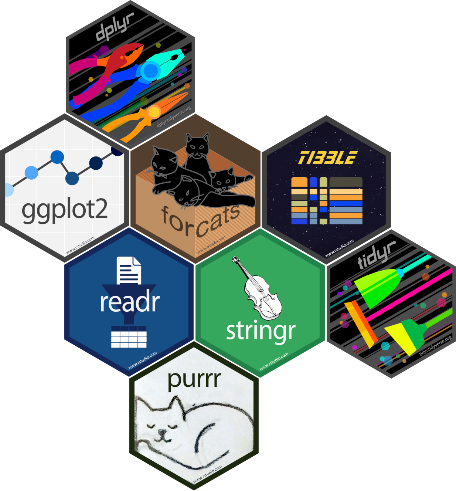
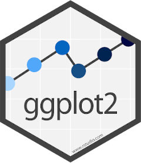

```{r setup, include=FALSE}
library("knitr")
library("rmarkdown")

statistics <- readRDS("../datasets/statistics.rds")

opts_chunk$set(fig.path = 'pics/s6-', # path for calculated figures
               fig.align = 'center',  # alignment of figure (also possible right, left, default)
               fig.show = 'hold', # how to show figures: hold -> direct at the end of code chunk; animate: all plots in an animation
               fig.width = 3,   # figure width
               fig.height = 4,  # figure height
               echo = TRUE,     # Code is printed
               eval = FALSE,    # Code is NOT evaluated
               warning = FALSE, # warnings are NOT displayed
               message = FALSE, # messages are NOT displayed
               size = "tiny",  # latex-size of code chunks
               background = "#E7E7E7", # background color of code chunks
               comment = "", # no hashtags before output
               options(width = 80),
               results = "markdown",
               rows.print = 15
)

htmltools::tagList(
  xaringanExtra::use_clipboard(
    button_text = "<i class=\"fa fa-clipboard\"></i>",
    success_text = "<i class=\"fa fa-check\" style=\"color: #90BE6D\"></i>",
    error_text = "<i class=\"fa fa-times-circle\" style=\"color: #F94144\"></i>"
  ),
  rmarkdown::html_dependency_font_awesome()
)
```

## Was ist tidyverse?
:::: {class="flex-container"}

::: {style="text-align: left; flex-grow:1; flex-basis: 30%"}
**Tidyverse** ist ein Paket, dass mehrere Pakete beinhaltet, die alle nach ähnlicher Syntax funktionieren und untereinander kompatibel sind. 

Es bietet somit einen sehr großen Funktionsumfang und wird daher auch viel genutzt.
:::

::: {style="text-align: center; flex-grow:1"}

:::

::::

## The Core tidyverse
:::: {class="flex-container"}

::: {style="text-align: left; flex-grow:1; flex-basis: 30%"}
**Tidyverse** beinhaltet Kernpakete, die allesamt mit dem Befehl ```library("tidyverse")``` geladen werden. Dies sind:

- **dplyr**
- **ggplot2**
- forcats
- tibble
- readr
- stringr
- **tidyr**
- purrr

:::

::: {style="text-align: center; flex-grow:1"}
{width="300px"}
:::

::::

## Drei Pakete im Fokus
:::: {class="flex-container"}

::: {class="flex-text"}
**dplyr** beinhaltet eine Grammatik, um Datenmanipulationen zu machen. Es besticht dabei durch seine Einfachheit und der Kombinationsmöglichkeit der Grundbefehle. Für eine erste Dateneinsicht ist dies meist hilfreich zu nutzen, oder um die Daten umzustrukturieren (manipulieren).
:::

::: {class="flex-picture"}
{width="300px"}
:::

::: {class="flex-text"}
**ggplot2** ist **das** Grafikpaket in R. Es bietet die Möglichkeit Grafiken genauestens den eigenen Präferenzen anzupassen und darzustellen. Dazu gibt es viele Erweiterungspakete, die ebenfalls auf der Syntax von **ggplot2** aufbauen.

:::

::: {class="flex-picture"}
{width="300px"}
:::

::: {class="flex-text"}
**stringr** ist ein Paket um ```string```-Variablen vernünftig in R bearbeiten zu können. Es gibt einige Alternativen, aber dennoch bleibt **stringr** ein beliebtes Paket zur Bearbeitung von ```string```-Variablen. Insbesondere bei Textanalysen muss man im Vorfeld die ```string```-Variablen bearbeiten. 

:::

::: {class="flex-picture"}
{width="300px"}
:::

::::

## Ziel des Workshops 
Die Teilnehmenden können am Ende des Workshops ...

> - ... die Grammatik der Pakete ggplot2 und tidyverse verstehen und auf eigene Zwecke anwenden.
> - ... Daten zielführend aufbereiten.
> - ... Daten und Ergebnisse sinnvoll darstellen.
> - ... erste eigene Funktionen programmieren.


## Ziel des Workshops
Es geht in diesem kurzen 1-Tages-Kurs vor allem um **Readbility-Skills**. Ziel ist es, dass man neue Probleme mit dem hier gezeigten lösen kann. Dafür sollte der Inhalt aber während des Workshops gut aufbereitet bzw. nachbereitet werden (eigene Notizen in den Skripten etc.).

## Wer ich bin und wie ich Workshops leite?
**Wer bin ich?**

> - seit 2015 Mitarbeiter an der Professur für Methoden (viele praktische Methoden-/Projektkurse bisher gegeben)
> - nutze seit mehreren Jahren bereits R
> - derzeit: gefördertes Lehrprojekt, in dem R-Kursmaterial für Personen aufbereitet wird, die keine Computer-/Programmierkenntnisse haben

**Wie ich meine Rolle als Workshopleiter sehe?**

> 1. kollegiales, respektvolles Mitaneinander
> 2. Interesse daran, anderen zu helfen/zu unterstützen
> 3. in der Ansprache ziehe ich das Du vor
> 4. Kurz-Inputs und dann eigenes *trial-and-error*
> 5. meine Rolle: Unterstützer/Helfer, aber nicht Motivator, Erzieher oder allwissender Guru
> 6. gebe Input, aktive Mitarbeit aber erforderlich


> * alle Kursmaterialien sind entweder auf [ILIAS](https://ilias.uni-giessen.de/ilias/goto.php?target=grp_247939&client_id=JLUG), auf [gitlab](https://gitlab.com/bpkleer/mtg-21-tidyverse) oder in der [R Studio Cloud]() runterzuladen.

## Arbeiten mit R
Arbeiten mit R heißt in der Regel immer wieder auf Probleme zu stoßen und willens zu sein, diese Probleme zu lösen. In meiner jetzt fast 10-jährigen Arbeit mit R bin ich noch nie auf ein Problem gestoßen, dass man nicht lösen konnte. 

**Wichtig dafür:** Lesefähigkeit von Code. Also das Verständnis von Code. Dies ist auch das primäre Ziel des heutigen Tages.

## Kursmaterialien
Wie gesagt, sind die Kursmaterialien direkt in der [RStudio Cloud](https://rstudio.cloud/spaces/146374/join?access_code=xfg7axLLy1bVgItjpH869s1Jg3Lmd9ajntRdEKMH) verlinkt, aber auch in [gitlab](https://gitlab.com/bpkleer/mtg-21-tidyverse).

Die ```code chunks``` haben ein integriertes *Clipboard*, mit dem der Code direkt in ein R Skript kopiert werden kann. Dafür geht man einfach beim betreffenden Code oben rechts auf das *Clipboard*-Zeichen. 

```{r codechunk}
install.packages("tidyverse",
                 dependencies = TRUE)
```

**Wichtig**: Bei den HTML-Präsentationen führt ein Mausklick immer zur nächsten Slide. Dies einfach deaktiveren, in dem man die Taste ```k``` drückt. Dann kann man in Ruhe den Code kopieren und mit den Pfeiltasten durch die Slide navigieren. In den HTML-Dokumenten am Nachmittag kann man einfach klicken, da es keine Präsentationen mehr sind. 

**Weitere Shortcuts für die Präsentationen:**

```b```, ```>```, ```+```: Text wird größer

```s```, ```<```, ```-```: Text wird kleiner

```f```: Fußzeile zeigen/verstecken

```c```, ```t```: Inhaltsverzeichnis (springen auf andere Seite möglich)


## Start {.break}
Der Kurs setzt Grundkenntnisse voraus. Ihr lernt euch jetzt in Breakout-Rooms kennen. In den Breakout-Rooms sollt ihr euch kennenlernen und ein paar Grundaufgaben in R lösen. Dies dient auch der Auffrischung. Ich schaue abwechselnd in den Breakout-Rooms nach. Ihr könnte mich aber auch rufen. 

Folgende Aufgaben sind zu erledigen:

> 1. Den Datensatz ```pss.rds``` in das environment laden (fiktiver Datensatz Panem Social Survey)

> 2. Die Variable ```agea``` deskriptiv beschreiben.

> 3. Schafft eine neue Variable, die dem Datensatz hinzugefügt werden soll. Diese Variable soll ```socgroup``` heißen und einfach eine Sequenz von ```1, 2, 3, 4``` über die Länge des Datensatzes beinhalten. **Wichtig**: Jede Zahl soll gleich oft vorkommen. Ob sich die Sequenz immer wiederholt (also Reihenfolge ```1, 2, 3, 4, 1, 2, 3, 4, ...```), oder ihr erst alle ```1```, dann alle ```2``` etc. abbildet, ist euch überlassen.

> 4. Vergesst nicht, euch gegenseitig vorzustellen!

**Zeit:** 30 Minuten. 

Wenn jemand nicht seine lokale R-Installation nutzen möchte, kann er einfach auf die **RStudio Cloud** zurückgreifen. Dort sind die Datensätze, Skripte & Folien auch bereits hinterlegt und müssen nicht direkt runtergeladen werden.

# Viel Spaß!

