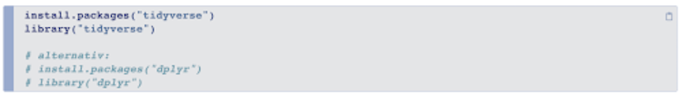

---
output:
  xaringan::moon_reader:
    css: ["./styles/slides.css"]  
    nature:
      seal: false
      highlightStyle: github
      highlightLines: true
      highlightLanguage: ["r"]
      countIncrementalSlides: false
      ratio: '16:9'
      slideNumberFormat: |
        <div class="progress-bar-container">
          <div class="progress-bar" style="width: calc(%current% / %total% * 100%);">
          </div>
        </div>`
      navigation:
        scroll: false
---

```{r setup, include=FALSE}
library("knitr")
library("rmarkdown")
library("tidyverse")
library("DT")
library("icons")

uni <- readRDS("../datasets/uni.rds")

opts_chunk$set(fig.path = "pics/dplyr-", # path for calculated figures
               fig.align = "center",  # alignment of figure (also possible right, left, default)
               fig.show = "hold", # how to show figures: hold -> direct at the end of code chunk; animate: all plots in an animation
               out.width = "60%",
               echo = TRUE,     # Code is printed
               eval = FALSE,    # Code is NOT evaluated
               warning = FALSE, # warnings are NOT displayed
               message = FALSE, # messages are NOT displayed
               background = "#E7E7E7", # background color of code chunks
               comment = "", # no hashtags before output
               results = "markdown",
               rows.print = 15
)

options(DT.options = list(pageLength = 5,
                          language = list(search = 'Filter:'),
                          autowidth = TRUE,
                          lengthChange = FALSE,
                          formatStyle = (fontSize = "40%"))
        )

htmltools::tagList(
  xaringanExtra::use_clipboard(
    button_text = "<i class=\"fa fa-clipboard\"></i>",
    success_text = "<i class=\"fa fa-check\" style=\"color: #90BE6D\"></i>",
    error_text = "<i class=\"fa fa-times-circle\" style=\"color: #F94144\"></i>"
  ),
  rmarkdown::html_dependency_font_awesome()
)

```

class: center, title-slide, middle

# Daten bändigen & visualisieren mit 

## Was wir machen und wie wir uns organisieren

### B. Philipp Kleer

### Methodentage 2021

### 11. Oktober 2021

.social[
   [`r icons::icon_style(fontawesome("orcid"), fill=rgb(235, 129, 27, maxColorValue = 255), scale = 1)`](https://orcid.org/0000-0003-1935-387X)   [`r icons::icon_style(fontawesome("gitlab"), fill=rgb(235, 129, 27, maxColorValue = 255), scale = 1)`](https://gitlab.com/bpkleer)   [`r icons::icon_style(fontawesome("university"), fill=rgb(235, 129, 27, maxColorValue = 255), scale = 1)`](https://www.uni-giessen.de/faculties/f03/departments/dps/staff/researchers/kleer?set_language=en)   [`r icons::icon_style(fontawesome("researchgate"), fill=rgb(235, 129, 27, maxColorValue = 255), scale = 1)`](https://www.researchgate.net/profile/Benedikt_Kleer)
]

---

# Was ist tidyverse?

.pull-left[
**Tidyverse** ist ein Paket, dass mehrere Pakete beinhaltet, die alle nach ähnlicher Syntax funktionieren und untereinander kompatibel sind. 

Es bietet somit einen sehr großen Funktionsumfang und wird daher auch viel genutzt.
]


.pull-right[
.center[

]
]

---

# The Core tidyverse

.pull-left[
**Tidyverse** beinhaltet Kernpakete, die allesamt mit dem Befehl `library("tidyverse")` geladen werden. Dies sind:

- **dplyr** (Datenbereinigung)
 
- **ggplot2** (Grafiken)
 
- **stringr** (Umgang mit Textdaten)

- **tidyr** (Umgang mit Datensätzen)

- forcats (Umgang mit Faktoren)

- tibble (Tabellentool)

- readr (Import von Daten)

- purrr (Umgang mit Funktionen und Vektoren)

]

.pull-right[
.center[
 
]
]

---

# Vier Pakete im Fokus

.pull-left[
.pull-left[
.center[
 

[Cheat-Sheet](https://github.com/rstudio/cheatsheets/blob/master/data-import.pdf) 
]
]

.pull-right[
.center[
 

[Cheat-Sheet](https://github.com/rstudio/cheatsheets/blob/master/data-transformation.pdf)
]
]
]

.pull-right[
.pull-left[
.center[
 

[Cheat-Sheet](https://github.com/rstudio/cheatsheets/blob/master/data-visualization-2.1.pdf)
]
]

.pull-right[
.center[
 

[Cheat-Sheet](https://github.com/rstudio/cheatsheets/blob/master/strings.pdf)
]
]
]

???

**tidyr** beinhaltet eine Grammatik, um Datensätze in ein *tidy* Format zu bringen. Ziel ist es, dass jede 
Spalte eine Variable ist, jede Zeile eine Beobachtung und jede Zelle einen Wert beinhaltet. Hier gibt es das zu `tidyr`.

**dplyr** beinhaltet eine Grammatik, um Datenmanipulationen zu machen. Es besticht dabei durch seine Einfachheit und der Kombinationsmöglichkeit der Grundbefehle. Für eine erste Dateneinsicht ist dies meist hilfreich zu nutzen, oder um die Daten umzustrukturieren (manipulieren). Hier gibt es das 

**ggplot2** ist **das** Grafikpaket in R. Es bietet die Möglichkeit Grafiken genauestens den eigenen Präferenzen anzupassen und darzustellen. Dazu gibt es viele Erweiterungspakete, die ebenfalls auf der Syntax von **ggplot2** aufbauen. Hier gibt es das 

**stringr** ist ein Paket um `string`-Variablen vernünftig in R bearbeiten zu können. Es gibt einige Alternativen, aber dennoch bleibt **stringr** ein beliebtes Paket zur Bearbeitung von `string`-Variablen. Insbesondere bei Textanalysen muss man im Vorfeld die p`string`-Variablen bearbeiten.


---

# Ziel des Workshops 

Die Teilnehmenden können am Ende des Workshops ...

--

- ... die Grammatik der Pakete ggplot2 und tidyverse verstehen und auf eigene Zwecke anwenden.

--

- ... Daten zielführend aufbereiten.

--

- ... Daten und Ergebnisse sinnvoll darstellen.

--

- ... erste eigene Funktionen programmieren.

---

# Ziel des Workshops
Es geht in diesem kurzen 1-Tages-Kurs vor allem um **Readbility-Skills**. Ziel ist es, dass man neue Probleme mit dem hier gezeigten lösen kann. Dafür sollte der Inhalt aber während des Workshops gut aufbereitet bzw. nachbereitet werden (eigene Notizen in den Skripten etc.).

--

In meinen Kursen gilt immer folgendes Prinzip: **Was man nicht schreibt, lernt man auch nicht!**

--

Es ist also eine didaktische Entscheidung von mir, dass es keine fertige Skripts gibt. Selbst programmieren heißt eben auch selbst Code schreiben und nicht nur einzelnen Felder austauschen (wie bei *Click and Play* mit SPSS). Ebenso wird meiner Meinung nach das Verständnis von Funktionen viel besser vermittelt. 

--

Die Slides bzw. HTML-Dokumente haben aber kopierbaren Code (ein bisschen Erleichterung). Wenn man in diesen Dokumenten über den Code geht, erscheint oben rechts ein *Clipboard*, mit dem man den Code in die Zwischenablage kopiert. 

--
 
  

---

# Wer ich bin und wie ich Workshops leite?

.pull-left[
**Wer bin ich?**

- seit 2015 Mitarbeiter an der Professur für Methoden (viele praktische Methoden-/Projektkurse bisher gegeben)
- nutze seit mehreren Jahren bereits R bzw. RStudio (vor allem Projekt-Funktion
- derzeit: gefördertes Lehrprojekt, in dem R-Kursmaterial für Personen aufbereitet wird, die keine Computer-/Programmierkenntnisse haben
]

--

.pull-right[
**Wie ich meine Rolle als Workshopleiter sehe?**

1. kollegiales, respektvolles Mitaneinander
2. Interesse daran, anderen zu helfen/zu unterstützen
3. in der Ansprache ziehe ich das Du vor
4. Kurz-Inputs und dann eigenes *trial-and-error*
5. Unterstützung beim Code-Crashing
6. gebe Input, aktive Mitarbeit aber erforderlich
]

--

Alle Kursmaterialien sind entweder auf [gitlab](https://gitlab.com/bpkleer/mtg-21-tidyverse) oder in der [R Studio Cloud](https://rstudio.cloud/spaces/146374/join?access_code=xfg7axLLy1bVgItjpH869s1Jg3Lmd9ajntRdEKMH) runterzuladen. In [ILIAS](https://ilias.uni-giessen.de/ilias/goto.php?target=grp_247939&client_id=JLUG) finden sich Links an die betreffenden Stellen.


---

# Arbeiten mit R
Arbeiten mit R heißt in der Regel immer wieder auf Probleme zu stoßen und willens zu sein, diese Probleme zu lösen. In meiner jetzt fast zehnjährigen Arbeit mit R bin ich noch nie auf ein Problem gestoßen, dass man nicht lösen konnte (auch wenn es manchmal umständlich war). 

--

**Wichtig dafür:** Lesefähigkeit von Code. Also das Verständnis von Code. Dies ist auch das primäre Ziel des heutigen Tages.


---

# Kursmaterialien
Wie gesagt, sind die Kursmaterialien direkt in der [RStudio Cloud](https://rstudio.cloud/spaces/146374/join?access_code=xfg7axLLy1bVgItjpH869s1Jg3Lmd9ajntRdEKMH) verlinkt, aber auch in [gitlab](https://gitlab.com/bpkleer/mtg-21-tidyverse).

Die `code chunks` haben ein integriertes *Clipboard*, mit dem der Code direkt in ein R Skript kopiert werden kann. Dafür geht man einfach beim betreffenden Code oben rechts auf das *Clipboard*-Zeichen. 

```{r codechunk}
install.packages("tidyverse",
                 dependencies = TRUE)
```

--

**Wichtig**: Es handelt sich um *.html*-Präsentationen, die grafisch nur dann korrekt angezeigt werden, wenn eben auch die anderen Ordner relativ genauso lokal gespeichert sind, wie es beim Download entsteht. 

---

# Coding Konvention
Jede Person hat eigene Vorlieben, was den geschriebenen Code angeht. Im Folgenden möchte ich nur kurz meine Präferenzen darlegen.

Für neue Variablen oder Dataframes nutze ich in der Regel das Format `lowerCamelCase`:
``` {r format}
df$newVar <- NA

newDf <- subset(df, 
                is.na(newVar
                      )
                )
```

--

Selbst geschrieben Funktionen schreibe ich mit `_`:
```{r format2}
own_mean <- function(x){
  mean = sum(x) / length(x)
  print(mean) 
  }
```


---

# Code Konvention
Wie im ersten Fall bereits sichtbar, trenne ich Argumente mit `Enter` (Zeilenumbruch) und setze Klammern ebenfalls in neue Zeilen. Das hat den Vorteil, dass die Kommentierung einfacher erfolgen kann. Hat eine Funktion nur ein einziges Argument bleibt die Klammer in der gleichen Zeile.

```{r format3}
# einzelnes Argument
library(tidyverse)

# mehrere Argumente
str_sub(tweet$text[23], # Quelle
        -20,  # Beginn 20. Buchstaben vom Ende
        -2    # vorletzter Buchstabe vom Ende
        )

```

---

# Start 
Der Kurs setzt Grundkenntnisse voraus. Ihr lernt euch jetzt in Breakout-Rooms kennen. In den Breakout-Rooms sollt ihr euch kennenlernen und ein paar Grundaufgaben in R lösen. Dies dient auch der Auffrischung. Ich schaue abwechselnd in den Breakout-Rooms nach. Ihr könnte mich aber auch rufen. 

Folgende Aufgaben sind zu erledigen:

1. Den Datensatz `pss.rds` in das environment laden (fiktiver Datensatz Panem Social Survey)

2. Die Variable `agea` deskriptiv beschreiben.

3. Schafft eine neue Variable, die dem Datensatz hinzugefügt werden soll. Diese Variable soll `socgroup` heißen und einfach eine Sequenz von `1, 2, 3, 4` über die Länge des Datensatzes beinhalten. **Wichtig**: Jede Zahl soll gleich oft vorkommen. Ob sich die Sequenz immer wiederholt (also Reihenfolge `1, 2, 3, 4, 1, 2, 3, 4, ...`), oder ihr erst alle `1`, dann alle `2` etc. abbildet, ist euch überlassen.

4. Vergesst nicht, euch gegenseitig vorzustellen!

**Zeit:** 30 Minuten. 

Wenn jemand nicht seine lokale R-Installation nutzen möchte, kann er einfach auf die **RStudio Cloud** zurückgreifen. Dort sind die Datensätze, Skripte & Folien auch bereits hinterlegt und müssen nicht direkt runtergeladen werden.

---

class: inverse2, mline, center, middle

# Das war's!

