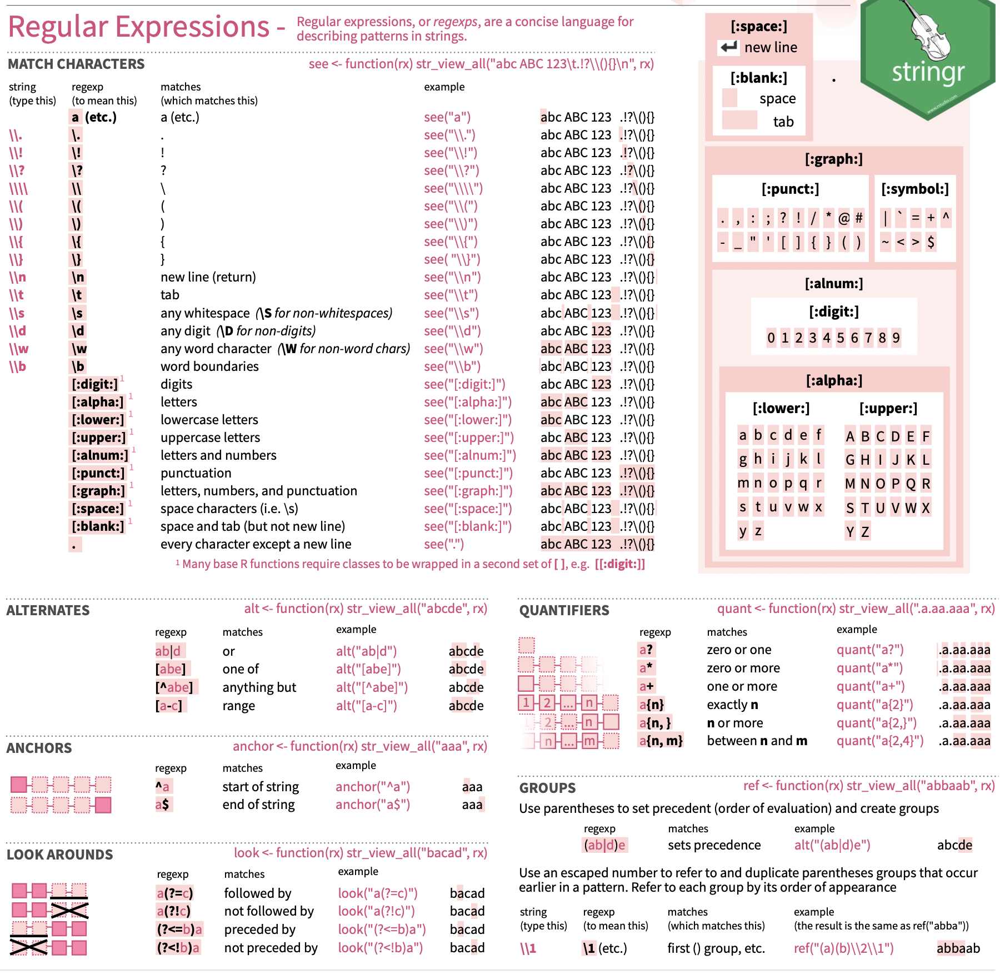

```{r setup, include=FALSE}
library("knitr")
library("rmarkdown")
library("tidyverse")

gbbo <- readRDS("../datasets/gbbo.rds")

opts_chunk$set(#fig.path = 'pics/s6-', # path for calculated figures
               fig.align = 'center',  # alignment of figure (also possible right, left, default)
               fig.show = 'hold', # how to show figures: hold -> direct at the end of code chunk; animate: all plots in an animation
               fig.width = 6,   # figure width
               fig.height = 6,  # figure height
               echo = TRUE,     # Code is printed
               eval = FALSE,    # Code is NOT evaluated
               warning = FALSE, # warnings are NOT displayed
               message = FALSE, # messages are NOT displayed
               size = "tiny",  # latex-size of code chunks
               background = "#E7E7E7", # background color of code chunks
               comment = "", # no hashtags before output
               options(width = 80),
               results = "markdown",
               rows.print = 15
)

htmltools::tagList(
  xaringanExtra::use_clipboard(
    button_text = "<i class=\"fa fa-clipboard\"></i>",
    success_text = "<i class=\"fa fa-check\" style=\"color: #90BE6D\"></i>",
    error_text = "<i class=\"fa fa-times-circle\" style=\"color: #F94144\"></i>"
  ),
  rmarkdown::html_dependency_font_awesome()
)
```


## Starten wir!
:::: {class="flex-container"}

::: {class="flex-text"}
In diesen Slides wollen wir uns mit Textdaten beschäftigen. Hieru lernen wir grundlegende Funktionen im Umgang mit Textdaten kennen. Eins vorweg: Textdaten sind immer schwieriger zu händeln als numerische Daten. Hierz werden im späteren Teil auch **regular expressions** eingeführt. Dies bleibt aber auf einem Grundlevel, weiterführend wird dazu sicherlich im Workshop zur quantitativen Textanalyse eingegangen.

In R gibt es innerhalb des **tidyverse** ein spezielles Paket zur Bearbeitung von Textdaten: **stringr**. Gemeinsam mit *regular expressions* können viele Transformationen und Bereinigungen durchgeführt werden.

Dieser Teil des Workshops bedarf aber einer erhöhten Lernbereitschaft (im Vergleich zu anderen Paketen und Funktionen). Das [Cheat-Sheet](https://github.com/rstudio/cheatsheets/raw/master/strings.pdf) zu ```stringr``` gibt es [hier](https://github.com/rstudio/cheatsheets/raw/master/strings.pdf).
:::

::: {class="flex-picture"}
{width="300px"}
:::

::::

## Wie bekommen wir Textdaten?
Als mögliche Textdaten fallen einem vermutlich sofort Tweets ein, oder für die Offline-Leute z.B. Wahlprogramme. In anderen Kursen der MethodenTage wird die Erhebung von Social Media-Daten über die sogenannte **API** (*Application Programming Interference*) erklärt. Wir überspringen jetzt diesen Schritt, da es hier erstmal nur um die grundlegenden Funktionen der Bearbeitung von Textvariablen in R geht.

Dafür habe ich die letzten Tweets der hervorragenden Sendung [The Great British Bake Off](https://thegreatbritishbakeoff.co.uk) über die Twitter-API geladen (Stand: 22. September 2021). Wir werden im nachfolgenden verschiedene Schritte durchführen, wie wir Textdaten mit den Funktionen des Pakets ```stringr``` bearbeiten können. 

## Package und Daten laden
Zuerst laden wir wieder ```tidyverse``` bzw. installieren es, wenn es noch nicht installiert ist:

``` {r install-tidy}
# install.packages("tidyverse")
library("tidyverse")

# alternativ: 
# install.packages("stringr")
# library("stringr")
```

Anschließend laden wir den Datensatz ```gbbo``` ins *environment*.

``` {r uni-load}
gbbo <- readRDS("../datasets/gbbo.rds")
 # oder eigenen Pfad, wenn nicht in Cloud
```

Schauen wir uns nun den Datensatz mal an:
``` {r data-inspect, eval = TRUE}
gbbo
```

Der Datensatz umfasst in Gänze 90 Variablen, für uns ist in diesem Fall aber nur eine einzige Variable erstmal relevant - nämlich ```text```. In ```text``` befindet sich der Text des jeweiligen Tweets. 

Der einfachheithalber speichern wir diese eine Variable als einzelnen Vektor, schaffen eine neue ID-Variable und erstellen den Datensatz ```tweet```.

```{r vektor, eval=TRUE}
tweet <- gbbo %>% 
  select(text)

tweet$id <- seq(1, 
                862, 
                1
                )

head(tweet,
     n = 100
     )
```

## Basisfunktionen in **stringr**
Die Basisfunktionen, die wir jetzt zu Beginn kennenlernen, sind folgende ...

- ```str_length()```

- ```str_sub()```

- ```str_dup()```

- ```str_pad()```

- ```str_trunc()```

- ```str_trim()```

- ```str_to_upper()``` / ```str_to_lower()``` / ```str_to_title()```

### ```str_length()```
Die Funktion ist ähnlich zur Funktion ```nchar()``` aus ```baseR```. Sie gibt die Länge der jeweiligen Zeichenkette an. Wir können dies für alle ausgeben lassen oder für einzelne Tweets. Wenn wir es für alle ausgeben lassen, ist die Ausgabe wieder ein Vektor, aber eben numerisch.

```{r length, eval=TRUE}
str_length(tweet$text)

# oder für einen spezifischen
str_length(tweet$text[23])

# oder mit piping
tweet %>% 
  filter(id == 275) %>% 
  select(text) %>% 
  str_length()

```

### ```str_sub()```
Wir können uns auch einzelne Zeichen aus einem String ausgeben lassen. So z.B. das zweite bis fünfte Zeichen aus dem 23. Tweet.

```{r sub, eval=TRUE}
# hier der 23. tweet
str_sub(tweet$text[23], 
        2, 
        5
        )

tweet %>% 
  filter(id == 23) %>% 
  select(text) %>% 
  str_sub(2, 
          5
          )
```

Natürlich kann man sich auch einzelne Buchstaben ausgeben lassen, dazu setzt man den Anfang (zweite Argument) und das Ende der Extraktion (dritte Argument) gleich. Will man von hinten zählen nimmt man einfach ein ```-``` zur Hilfe.

```{r sub2, eval=TRUE}
# hier der 23. tweet
str_sub(tweet$text[23], 
        25, 
        25
        )

str_sub(tweet$text[23], 
        -23, 
        -2
        )
```

**Eine kleine Denkaufgabe**: Warum ist die erste Ausgabe leer?

Alternativ kann man so auch bestimmte Stellen im Text ersetzen, sofern man deren numerische Stellen kennt. Wie dies einfacher mit *regular expression* geht, lernen wir später.
```{r sub3, eval=TRUE}
tweet$text[23]

str_sub(tweet$text[23], 
        26, 
        26
        ) <- "M"

tweet$text[23]
```

### ```str_dup()```
Anstatt Zeichen zu löschen oder zu ersetzen, können wir Zeichen auch duplizieren. Wiederholen wir einfach den Text von Tweet 23 viermal.
```{r dup, eval=TRUE}
str_dup(tweet$text[23],
        4
        )
```

Man kann das ganze auch verketten und wieder direkt *pipen* mit ```tidyverse```.
```{r dup2, eval=TRUE}
tweet %>% 
  filter(id == 23) %>% 
  select(text) %>% 
  str_sub(1,
          8
          ) %>% 
  str_dup(4)
```
**Kleine Denkaufgabe**: Was wird hier wiederholt?

### ```str_pad()```
Oft ist es von Vorteil, wenn Zeichenketten dieselbe Länge aufweisen, z.B. wenn man sie gleichmäßig grafisch darstellen möchte. Dies können wir mit ```str_pad()``` machen: Die Zeichenkette soll 100 Zeichen lang werden. Zuerst erstellen wir dazu aber einfach einen Character-Vektor, der nur zwei Tweets beinhaltet (Nr. 23 und 731).

``` {r pad, eval=TRUE}
partOfTweet  <- tweet$text[c(23,
                             731
                             )
                           ]

partOfTweet
```

Wir haben jetzt also einen einzelnen Vektor, der zwei Tweets beinhaltet. Jetzt wollen wir die Länge auf 100 festsetzen:
```{r pad2, eval=TRUE}
partOfTweet <- str_pad(partOfTweet, 
                       100, 
                       side = "both"
                       )

partOfTweet
```
**Kleine Denkaufgabe**: Was passiert hier nun beim zweiten Tweet?

Anscheinend nichts. Und das ist auch gut so! Denn ansonsten hätte die Funktion den Tweet gekürzt und dies macht die Funktion eben nicht. Ist ein Text länger als es in ```str_pad()``` angegeben ist, bleibt der Tweet so wie er ist, erhalten. 

### Eleganter Pipen
Oben haben wir ja bereits mit ```tidyverse``` **pipes** benutzt, dies machen wir jetzt aber eleganter. Die Funktionen aus ```stringr``` haben alle kein Datenargument, daher sind sie auch nicht direkt zu pipen. Das führt immer zu Fehlermeldungen.
``` {r wrongpipe, eval=FALSE, warnings=TRUE}
tweet <- tweet %>% 
  str_pad(text, 
          100, 
          side = "both"
          )
```

Die Funktionen aus ```stringr``` sind allesamt direkt Mutationen eines Vektors. Mithilfe von ```mutate()``` können wir diese aber auch mit **Pipes** benutzen. Wir definieren eine neue Variable und dieser Variable ordnen wir die Mutation über die ```stringr```-Funktion zu. 
```{r pad-pipe, eval=TRUE}
tweet <- tweet %>% 
  mutate(shortT = str_pad(text, 
                          100, 
                          side = "both"
                          )
         )

head(tweet$shortT, 
     n = 50
     )
```

Es ist zwar ein Umweg, aber ein guter: Denn so bleibt die Ursprungsvariable immer im Datensatz erhalten. Nicht zu empfehlen ist es die Originalvariable direkt in ```mutate()``` zu überschreiben.

### ```str_trunc()```
Um gleichzeitig die Tweets zu kürzen, benutzt man die Funktion ```str_trunc()```. Hiermit kann die maximale Zeichenkettenzahl gesetzt werden. So könnten wir zum Beispiel sagen, uns interessiert nur der Beginn der Tweets, also die ersten 50 Zeichen. 

``` {r trunc, eval=TRUE}
tweet <- tweet %>% 
  mutate(truncT = str_trunc(text, 
                            50
                            ),
         truncT = str_pad(truncT, 
                          60, 
                          side = "both"
                          )
         )

head(tweet$truncT, 
     n = 50
     )
```

Wie man sieht, werden Tweets die länger als 50 Zeichen sind mit ```...``` am Ende gekennzeichnet. 

### ```str_trim()```
Hat man am Ende oder Beginn Leerzeichen, nutzt man einfach ```str_trim()```, um diese zu entfernen. Die zuvor geschaffenen Leerzeichen, entfernen wir jetzt wieder. 
``` {r trim, eval=TRUE}
tweet <- tweet %>% 
  mutate(truncT2 = str_trim(truncT, 
                            side = "both"
                            )
         )

head(tweet$truncT2, 
     n = 50
     )
```

### ```str_to_upper()``` / ```str_to_lower()``` / ```str_to_title()```
Groß- und Kleinschreibung spielt gerade bei der quantitativen Analyse von Texten keine Rolle. Daher ändert man in der Regel alle Zeichen auf Großbuchstaben (```str_to_upper()```) oder auf Kleinbuchstaben (```str_to_lower```). Teste gleich anschließend selbst aus, was die Funktion ```str_to_title()``` macht!

``` {r schreibweise, eval=TRUE}
tweet <- tweet %>% 
  mutate(truncT2 = str_to_lower(truncT2
                                )
         )

head(tweet$truncT2, 
     n = 50
     )
```

Das war es zu den Basis-Funktionen. Jetzt gehen wir über zu Funktionen, die insbesondere in Kombination mit **regular expressions** helfen, Textdaten für die Analyse gut vorzubereiten. 

## Funktionen mit Regular Expression
Mit **regular expression** (*regex*) können Zeichenkette bestimmt werden, die beliebig eingesetzt werden können. Dabei werden per Code gewisse Muster vorgegeben, mithilfe denen R diese im Text erkennt und die gewünschte Transformation vornimmt. Es ist eine spezifische Art mit Textdaten umzugehen und zu identifizieren.

Eine gute Übersicht gibt es auf [Wikipedia](https://de.wikipedia.org/wiki/Regulärer_Ausdruck#Syntax) oder im [Cheat-Sheet von stringr](https://github.com/rstudio/cheatsheets/raw/master/strings.pdf)

Hier der Ausschnitt aus dem **Cheat-Sheet**.




Die folgenden Funktionen werden oftmals in Kombination mit *regex* eingesetzt, um String-Variablen zu bearbeiten und wir werden diese im Folgenden genauer kennenlernen.

- ```str_detect()``` / ```str_count()```

- ```str_extract()```

- ```str_subset()```

- ```str_replace()```

### ```str_detect()``` / ```str_count()```
Machen wir der einfachheithalber nochmal ein Subsample, dass nur 50 Tweets erhält. 
```{r subsample, eval=TRUE}
tweet2 <- tweet %>% 
  filter(id < 51) %>% 
  select(id,
         text
         )
```

In diesem möchten wir nun die Tweets finden, die das Wort *thanks* beinhalten. Die Funktion gibt einen **Boolean**-Wert zurück, also ```TRUE``` oder ```FALSE```.
```{r detect, eval=TRUE}
tweet2 <- tweet2 %>% 
  mutate(includesThanks = str_detect(text, 
                                     "thanks"
                                     )
         )

table(tweet2$includesThanks)
```

Kein Tweet beinhaltet also *thanks*, aber was ist mit Tweet 7?
```{r detect2, eval=TRUE}
tweet2$text[7]
```

**Kleine Denkaufgabe**: Wo könnte das Problem liegen?

Das Problem liegt im großen ```T```, da wir in der Anweisung nicht berücksichtigt haben, dass es uns egal ist, ob es genau die Reihenfolge ist oder ob Groß-/Kleinschreibung unberücksichtigt bleiben soll. Dazu benötigen wir die Hilfsfunktion ```regex()``` (Funktion für **regular expressions**), bei der wir im Argument ```ignore_case = TRUE``` angeben, dass es egal ist, ob die Buchstaben klein oder groß geschrieben sind, sondern nur das Muster der Reihenfolge vorhanden sein muss.
```{r detect3, eval=TRUE}
tweet2 <- tweet2 %>% 
  mutate(includeThanks = str_detect(text, 
                                    regex("thanks",
                                          ignore_case = TRUE
                                          )
                                    )
         )

table(tweet2$includeThanks)
```

Nur noch einmal zur Logik von **regular expressions**: In diesem Fall möchten wir das Wort ```thanks``` in Tweets suchen. Dazu geben wir in ```regex()``` die Buchstabenreihenfolge an, die eben dieses Wort kennzeichen, also ```thanks```. Hätten wir einen Tweet mit dem Wort ```thanksgiving``` würde dies in diesem Fall auch als ```TRUE``` ausgegeben werden, da es eben auch die Buchstabenreihenfolge beinhaltet. 

``` {r test-detect, eval=TRUE}
beispiel <- c("Thanks! It means a lot to me", 
              "I hope I see you on Thanksgiving", 
              "Maybe next time!")

str_detect(beispiel, 
           regex("thanks", 
                 ignore_case = TRUE
                 )
           )
```

Um dies jetzt zu umgehen, könnte man einfügen, dass nach dem Ende der Buchstabenreihenfolge ein Leerzeichen folgen muss und davor ein Leerzeichen sein kann oder aber auch nicht (Satzanfang!).

Für Leerzeichen setzt man in **regular expressions** ```\\s``` in R. D.h. vor ```thanks``` setzen wir ```\\s```. Da wir aber wollen das auch ein Wort am Satzanfang gezählt wird, setzen wir dahinter ein ```?```, was bedeutet, dass die keinmal oder mehr vorkommen kann. Somit hätten wir in der **regular expression**: ```\\s?thanks```. Jetzt wollen wir aber noch Wörter ausschließen, die mit ```thanks``` beginnen. Dazu können wir wieder ein Leerzeichen setzen. Machen wir nur das wird kein ```thanks``` gezählt, da im ersten Item kein Leerzeichen, sondern ein Satzzeichen folgt. Daher geben wir in der **regular expression** an, dass entweder ein Leerzeichen (```\\s```) oder ein Satzzeichen (```[:punct:]```) folgt. Der gesamte **regex**-Ausdruck ist also: ```\\s?thanks(\\s|[:punct:])```. Dies setzen wir nun ein und schauen, ob die Funktion es nun richtig erkennt. 

```{r test-detect2, eval=TRUE}
str_detect(beispiel, 
           regex("\\s?thanks(\\s|[:punct:])", 
                 ignore_case = TRUE
                 )
           )
``` 

Wie das Beispiel verdeutlicht, kann es sehr schnell kompliziert werden mit Textdaten. Das ist nicht schlimmes, nur sollte man sich dessen bewusst sein und ziemlich konkret und genau überlegen, wie man Textdaten bearbeitet. 

Will man anstatt eines **Boolean**-Wertes die Häufigkeit des Vorkommens einer Buchstabenkette erhalten, nutzt man ```str_count()```. Wir könnten z. B. testen, wie oft der Name ```"Prue"``` (eine der zwei Judges) in den Tweets vorkommt.

``` {r count, eval=TRUE}
tweet2 <- tweet2 %>% 
  mutate(countPrue = str_count(text, 
                               regex("Prue", 
                                     ignore_case = TRUE
                                     )
                               )
         )

tweet2 %>% 
  select(text, 
         countPrue
         )

```

### ```str_extract()```
Mit dieser Funktion kann ein spezifischer Textteil gesucht werden und gleichzeitig extrahiert werden. Wir erhalten dann einen neuen Vektor/Variable, die das erste Vorkommen der gesuchten Kombination enthält. Will man alle Kombinationen extrahieren, die vorliegen, nutzt man einfach ```str_extract_all()```.

```{r extract, eval=TRUE}
tweet2 %>% 
  mutate(extractThanks = str_extract(text, 
                                     regex("thanks",
                                           ignore_case = TRUE
                                           )
                                     )
         )
```

**Zur Erinnerung**: Warum benutzen wir hier die Hilfsfunktion ```regex()```?

Will man zum Beispiel alle *mentions* in einem Tweet erhalten, nutzt man ```str_extract_all()```. Diese Funktion extrahiert nicht nur das erste Vorkommen, sondern alle Vorkommen. Probieren wir es aus.

```{r extract2, eval=TRUE}
tweet2 <- tweet2 %>% 
  mutate(mentions = str_extract(text, 
                                "@"
                                )
         )

tweet2 %>% 
  select(id, 
         text, 
         mentions
         )
```

**Denkaufgabe**: Welches Problem haben wir jetzt (wieder(?

Es wird zwar das **@**-Zeichen gefiltert, aber nicht der Text danach, mit dem wir die *mention* identifizieren können. 

Wir wollen das jetzt mal probieren. Logisch benötigen wir einen Befehl, er uns sagt, dass das \@-Zeichen mit den anhängenden Zeichen bis zum nächsten Leerzeichen entnommen werden soll. Bei **regex** gibt es den Unterbefehl ```\w```, mit dem der nachfolgende *word character* extrahiert wird. Also mit ```@\\w``` erhalten wir das \@-Zeichen und den ersten Buchstaben der *mention*. Wenn wir nach dem ```w``` noch ein ```+``` einfügen, erhält man die nachfolgenden *word character* bis zum nächsten *non-word character*.

```{r extractMention, eval=TRUE}
tweet <- tweet %>% 
  mutate(mention = str_extract_all(text, 
                                   regex("@\\w+"
                                         ),
                                   simplify = FALSE
                                   )
         )

head(tweet$mention, 
     n = 50
     )
```

Eine Sache muss man hier aber berücksichtigen: ```str_extract()``` erstellt eine Liste! Das heißt für jede Zeile im Datensatz erhalten wir eine Liste, in der dann die einzelnen *mentions* als ein Item gespeichert sind. Das ist fürs Datenhandling nicht ganz optimal.

```{r extractList, eval=TRUE}
tweet$mention[9][1]
```

Um dies wiederum aufzuheben, ist ein weiterer Schritt notwendig, so dass wir so viele Variablen für ```mentions``` haben, wie es maximal pro Tweet gibt. Dazu nutzen wir die Funktion ```unnest_wider()``` aus ```tidyr```:

```{r unnest, eval=TRUE}
tweet <- tweet %>% 
  unnest_wider(mention)

head(tweet)
```

Jetzt sollten nur noch die Spaltennamen umbenannt werden mit ```rename()``` (aus ```dplyr```):
```{r rename, eval=TRUE}
tweet <- tweet %>% 
  rename("mention1" = "...1",
         "mention2" = "...2",
         "mention3" = "...3",
         "mention4" = "...4",
         "mention5" = "...5",
         "mention6" = "...6",
         "mention7" = "...7",
         "mention8" = "...8"
         )

tweet
```

Jetzt haben wir ein *tidy*-Format wieder, in dem jede Spalte eine Variable ist, jede Zeile ein Beobachtung und jede Zelle ein einzelner Wert!

### ```str_subset()```
Mit dieser Funktion können wir Textdaten filtern. Wir geben ein gewisses Muster aus Textzeichen an und die Textdaten, auf die es zutrifft, werden dann herausgefiltert. Dies könnten wir zum Beispiel benötigen, wenn wir nur die Tweets berücksichtigen wollen, die eben auch *mentions* beinhalten. So könnten wir diese Tweets heraussuchen. 
```{r subset, eval=TRUE}
tweetWithMentions <- str_subset(tweet$text, 
                                regex("@\\w+")
                                )

tweetWithMentions

```

An dieser Stelle nicht verzweifeln! **Regular expressions** scheinen am Anfang sehr kompliziert, aber das täuscht! Man muss sich einfach nur ein bisschen einarbeiten und mit **regex** üben. 

### ```str_replace()```
Oftmals müssen Textdaten vor der eigentlichen Textanalyse bereinigt werden. In Tweets hat man oftmals unnötige Umbrüche die im Tweet-Text mit ```\n``` gekennzeichnet werden. Oder man findet doppelte Leerzeichen. Mit ```str_replace()``` kann man so etwas entfernen. Auch hier verwenden wir wieder **regex**, um die Muster zu identifizieren. Denn wir wollen wir die Textanalyse nur reinen Text vorliegen haben. Zuerst entfernen wir die Umbrüche (```\n```) und dann die mehrfachen Leerzeichen.

```{r replace, eval=TRUE}
tweet$text[13]

tweet <- tweet %>% 
  mutate(text = str_replace_all(text, 
                                regex("\\n",
                                      ignore_case = TRUE
                                      ),
                                ""
                                ),
         text = str_replace_all(text, 
                                  regex(" +"),
                                  " "
                                )
         )


tweet$text[13]

```

Für die reine Textanalyse entfernt man oftmals auch die URLs, die Hashtags sowie die *mentions*:
```{r replaceOther, eval=TRUE}
tweet$text[9]

tweet <- tweet %>% 
  mutate(cleanText = str_replace_all(text, 
                                      regex("http\\S+\\s*"),
                                      ""
                                     ),
         cleanText = str_replace_all(cleanText, 
                                     regex("#\\w+"),
                                     ""
                                     ),
         cleanText = str_replace_all(cleanText, 
                                     regex("@\\w+"), 
                                     ""
                                     ),
         cleanText = str_replace_all(cleanText, 
                                     regex(" +"), 
                                     " "
                                     )
         )

tweet$cleanText[9]
```

Jetzt haben wir noch am Beginn des Strings und am Ende ein Leerzeichen, aber auch dieses können wir entfernen:
``` {r replaceStart, eval=TRUE}
tweet <- tweet %>% 
  mutate(cleanText = str_replace(cleanText, 
                                 regex("^ "),
                                 ""
                                 ),
         cleanText = str_replace(cleanText, 
                                 regex(" $"),
                                 ""
                                 )
         )

tweet$cleanText[9]
```

Jetzt ist der Text bereinigt und wir haben in der Variable ```cleanText``` den reinen Text, den man dann in weiteren Anwendungen analysieren kann. 

#### Das war's
Das waren die Grundfunktionen aus dem Paket mit ```stringr```. 

Die Übungsaufgaben finden sich in der RStudio Cloud im Projekt ```task stringr```.